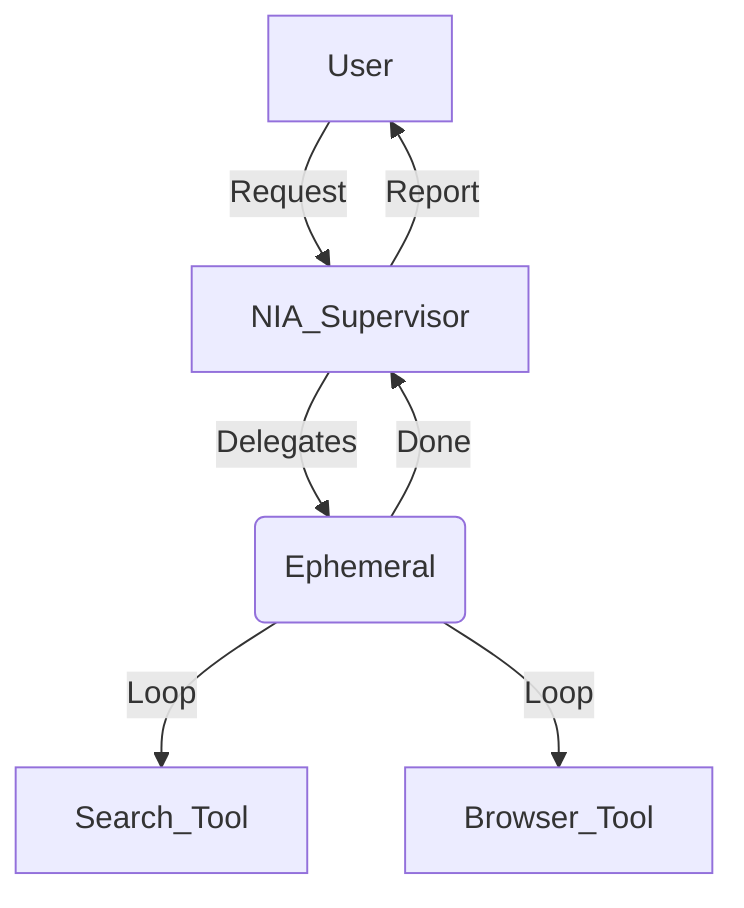

# NIA Deep Scan Report & Strategy

## Executive Summary

This report provides a comprehensive analysis of the NIA (Neural Intelligence Assistant) architecture, focusing on the TARA automation system, modularity assessment, and a strategic roadmap for achieving "Full Computer Access" and implementing "Ephemeral Agents".

**Key Findings:**
- **System Modularity:** The system is highly modular. NIA (Supervisor) is decoupled from TARA (Tools) and IRIS (Vision) via LangGraph and a Service Registry pattern.
- **TARA Capabilities:** Strong foundation for app management, file operations, and basic input. Limited by "Safe Zone" security restrictions and lack of a direct shell/terminal interface.
- **OpenClaw Comparison:** OpenClaw offers proactive, local control via messaging but lacks the safety guardrails present in NIA's architecture.
- **Path to Full Access:** Achievable by expanding "Safe Zones", implementing a secure Shell Tool, and tightening the Vision-Action loop.

---

## 1. TARA System Analysis

### 1.1 How TARA Works
TARA (Tool-Augmented Reasoning Agent) operates as a specialized subgraph within the NIA architecture. It follows a **Reason-Act-Observe** loop:

1.  **Reasoning (Brain):** The `reasoner` node analyzes the user's request and the current state (screen context, open windows, clipboard). It uses an LLM to decide which tool to call.
2.  **Action (Hands):** The `tool_executor` node executes the selected tool(s). It supports parallel execution (e.g., "launch chrome and notepad").
3.  **Observation (Eyes):** The tool returns a result (success/error message, text content). This feeds back into the state for the next reasoning cycle.

### 1.2 Current Capabilities
TARA is equipped with several "atomic" tool categories:

*   **App Control (`apps.py`):**
    *   `launch_app(name)`: Intelligent launching with path resolution and window verification.
    *   `kill_app(name)`: Terminates processes by name or PID.
    *   `list_processes()`: Views running tasks.
*   **Window Management (`window_manager.py`):**
    *   Tracks open windows by alias (e.g., `notepad_1`).
    *   Persists window state across sessions (in `data/window_registry.json`).
*   **Input Simulation (`input.py`):**
    *   **Mouse:** `click`, `drag`, `scroll` (coordinate-based).
    *   **Keyboard:** `type`, `press`, `hotkey` (e.g., Ctrl+C).
    *   *Limitation:* Mouse control relies on knowing X,Y coordinates, often requiring IRIS (Vision) to find elements first.
*   **File Operations (`files.py`):**
    *   `read`, `write`, `append`, `list_dir`, `delete`, `move`, `copy`, `search`.
    *   *Security:* Strictly confined to "Safe Zones" defined in the system context. Access outside these zones is blocked by the Warden.

### 1.3 Security Architecture (The Warden)
TARA includes a `WardenService` (`security.py`) that acts as an interceptor for high-risk tools.
-   **Blocking Mode:** It intercepts calls to `delete_file` or `launch_app` before execution.
-   **Safe Zones:** Enforces file operations to occur only within allowed directories (e.g., workspace).
-   **App Allow-list:** Can be configured to block dangerous apps (like `cmd`, `powershell`), though currently permissive for standard apps.

---

## 2. Modularity Assessment

**Verdict: Highly Modular**

The system adheres to strict modularity principles, preventing "spaghetti code" and ensuring stability:

1.  **Decoupled Supervisor:** The NIA Supervisor (`nia/agent.py`) does **not** import TARA or IRIS directly.
    -   It uses a **Routing Gatekeeper** to decide *intent* (e.g., "User wants automation" -> Route to TARA).
    -   The actual wiring happens in the **LangGraph Builder** (`nia/graph/builder.py`), which acts as the composition root.
2.  **Protocol-Based Dependencies:** Components talk to each other via defined interfaces (Protocols) or the central `ServiceRegistry`.
    -   Example: NIA accesses Memory via `ServiceRegistry.get("memory")`, not by importing the memory module directly.
3.  **Benefit:** You can swap out TARA for a different automation engine, or IRIS for a different vision model, without breaking the Supervisor logic.

---

## 3. OpenClaw Research & Comparison

**What is OpenClaw?**
-   A local, "always-on" AI agent (formerly Moltbot/Clawbot).
-   **Key Feature:** Integrates with messaging platforms (Telegram, Discord, WhatsApp) to allow remote control of your computer via chat.
-   **Philosophy:** "Proactive" assistance (like an accountant) vs. "Reactive" (like a calculator).
-   **Risks:** Often criticized for having "no guardrails." Exposing it to the internet (to use via Telegram) gives it full control over your local machine, creating a massive security vulnerability.

**Comparison with NIA:**
| Feature | NIA | OpenClaw |
| :--- | :--- | :--- |
| **Architecture** | Modular Supervisor (LangGraph) | Monolithic "Bot" |
| **Interaction** | Desktop/Voice/Chat | Messaging Apps (Telegram/Discord) |
| **Security** | High (Warden, Safe Zones) | Low (No guardrails) |
| **Control** | Structured Tool Use | Direct execution |
| **Philosophy** | Task-based Specialist | Always-on Generalist |

---

## 4. Strategy: Giving NIA "Full Computer Access"

To give NIA true "full computer access" (like a human developer), you need to bridge three specific gaps in the current implementation.

### Step 1: Expand "Safe Zones" (The Filesystem)
Currently, TARA is locked in specific directories.
-   **Action:** Modify `src/core/context.py` (or your `.env` configuration) to add your root drive (e.g., `C:/` or `/`) to the `SAFE_ZONES` list.
-   **Warning:** This allows the agent to modify/delete system files. Ensure the `Warden` is active to log these actions.

### Step 2: Implement a Shell Tool (The Terminal)
TARA lacks a command-line interface. A "Full Access" agent needs to run shell commands (git, pip, npm, system settings).
-   **Proposal:** Create `src/agents/tara/tools/shell.py`.
-   **Capability:** Use `subprocess.run` to execute bash/powershell commands.
-   **Security:** This is the most dangerous tool. Implement a "Human in the Loop" check in the Warden for *any* shell command, or a strict allow-list.

### Step 3: Vision-Action Loop (The Eyes & Hands)
"Full Access" means clicking things that don't have APIs (like a specific button in a legacy app).
-   **Integration:** TARA needs to ask IRIS: *"Where is the 'Submit' button on screen?"* -> IRIS returns coordinates `(x=500, y=300)` -> TARA calls `mouse_click(500, 300)`.
-   **Current State:** The components exist (`iris` for vision, `input.py` for clicking), but the *workflow* needs to be explicitly taught or scripted in the TARA reasoner.

---

## 5. Strategy: Ephemeral Agents

You requested an agent that "comes for a specific task and then goes away."

### Proposed Architecture: "Task SubGraphs"
Instead of a single monolithic agent, use LangGraph's nested graph capability to spawn temporary worker agents.

1.  **The Spawner:** The main NIA Supervisor identifies a complex task (e.g., "Research OpenClaw").
2.  **The Ephemeral Agent:** It initializes a `ResearchGraph`—a specialized, self-contained LangGraph workflow.
    -   **State:** Has its own memory scratchpad, separate from the main chat.
    -   **Tools:** Access only to `browser` and `summary` tools (principle of least privilege).
    -   **Lifecycle:**
        -   **Born:** When invoked by the Supervisor.
        -   **Lives:** Cycles through `Search -> Read -> Summarize` until the goal is met.
        -   **Dies:** Returns the final report string to the Supervisor and clears its state.
3.  **Implementation:** Define these as `CompiledGraph` objects in `src/agents/specialists/` and import them into the main NIA graph as nodes.

### Example Workflow

This ensures that the "context window" of the main agent doesn't get cluttered with the intermediate steps of the sub-task.
