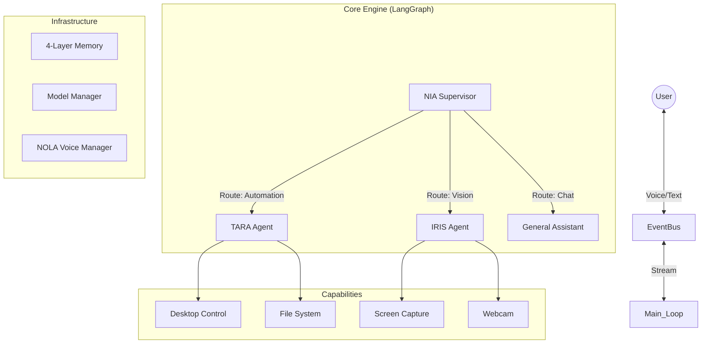

# N.I.A. (Neural Intelligence Assistant) - System Architecture

## 1. System Overview

**N.I.A.** is a locally-hosted, multimodal AI assistant designed for proactive desktop automation, intelligent conversation, and seamless interaction via voice and text.

It distinguishes itself from typical chatbots by being an **Agentic System**: it can see your screen, hear your voice, control your mouse/keyboard, and manage your applications.

**Core Philosophy:**
-   **Local First:** Prioritizes local execution (Ollama, local speech models) for privacy and speed.
-   **Modular:** Built on a decoupled Service Registry pattern, allowing easy swapping of components (e.g., changing the Vision provider from NVIDIA to OpenAI).
-   **Safe:** Implements a "Warden" system to intercept and validate high-risk actions (file deletion, app launching).

---

## 2. High-Level Architecture

The system follows a **Supervisor-Worker** architecture powered by **LangGraph**.



### Key Components

1.  **NIA (Supervisor):** The brain. It analyzes user intent and routes tasks to specialists.
2.  **TARA (Tool-Augmented Reasoning Agent):** The hands. Handles automation (files, apps, input).
3.  **IRIS (Intelligent Recognition & Image System):** The eyes. Handles screen analysis and webcam input.
4.  **NOLA (Neural Operator for Language & Audio):** The mouth and ears. Handles Wake Word detection, STT (Speech-to-Text), and TTS (Text-to-Speech).

---

## 3. Core Infrastructure

### 3.1 Service Registry Pattern
NIA uses a strict Dependency Injection system via `src.core.registry.ServiceRegistry`.
-   Components register themselves at startup (e.g., `ServiceRegistry.register("voice", nola_manager)`).
-   Other components request services by name (e.g., `ServiceRegistry.get("voice")`).
-   **Benefit:** Zero circular dependencies and easy mocking for tests.

### 3.2 Model Manager (`src/models`)
A unified factory for LLM providers.
-   **Multi-Provider:** Supports NVIDIA NIM, OpenAI, Groq, and Ollama.
-   **Hot-Swap:** Can switch the active provider at runtime without restarting.
-   **SafeLLM:** A "Circuit Breaker" wrapper that automatically retries failed requests (e.g., 429 Rate Limit) and falls back to alternative providers.

### 3.3 4-Layer Hybrid Memory (`src/core/memory.py`)
NIA remembers you through four distinct layers:
1.  **Episodic (ChromaDB):** Vector storage for semantic search of past conversations.
2.  **Procedural (NetworkX):** Graph-based storage of "Skill Chains" (e.g., "How to open Spotify" -> `[launch_app, click_play]`).
3.  **Preferences (SQLite):** Key-value store for user settings.
4.  **Security (SQLite):** Audit logs of allowed/blocked actions.

### 3.4 Event Bus (`src/core/events.py`)
Decoupled communication channel.
-   NOLA emits `voice_command` events.
-   The Engine listens and triggers the LangGraph workflow.
-   Plugins can subscribe to events to extend functionality.

---

## 4. Subsystem Deep Dive

### 4.1 TARA (Automation)
-   **Execution:** Uses `pyautogui` for mouse/keyboard and `subprocess` for app management.
-   **Window Management:** Tracks open windows by alias (e.g., `notepad_1`) using `pygetwindow`.
-   **Security:** `WardenService` intercepts high-risk tools.
    -   *Safe Zones:* File operations are restricted to specific directories.
    -   *Blocking:* Deletions require explicit confirmation parameters.

### 4.2 IRIS (Vision)
-   **Dynamic Intent:** Detects if you want to "look at the screen" vs "take a selfie".
-   **Analysis:** Uses Vision-Language Models (e.g., Llama 3.2 Vision) to describe images.
-   **Sentry Mode:** A background thread that periodically checks the screen for changes (optional).

### 4.3 NOLA (Voice)
-   **Wake Word:** Runs a local lightweight model (Vosk) to detect "Hey Nia" or "Jarvis".
-   **State Machine:** `ASLEEP` -> `AWAKE` -> `PROCESSING` -> `ASLEEP`.
-   **Hardware Control:** Truly releases the microphone handle when paused, allowing other apps to use it.

---

## 5. Technology Stack

| Category | Technology | Purpose |
| :--- | :--- | :--- |
| **Language** | Python 3.11+ | Core logic |
| **Orchestration** | LangGraph / LangChain | Agent workflows and LLM abstraction |
| **LLM Providers** | NVIDIA NIM, OpenAI, Groq, Ollama | Intelligence backend |
| **Memory** | ChromaDB (Vector), SQLite (Relational), NetworkX (Graph) | State persistence |
| **Desktop Control** | PyAutoGUI, PyGetWindow, PyWin32 | Mouse/Keyboard/Window APIs |
| **Vision** | OpenCV, Pillow, MSS | Image capture and processing |
| **Audio** | Vosk (STT), Edge-TTS (TTS), SoundDevice | Voice I/O |
| **Browser** | Playwright | Web automation |
| **Utilities** | Pydantic (Config), Aiosqlite (Async DB) | Infrastructure |

---

## 6. Directory Structure

```text
src/
├── agents/
│   ├── nia/       # Supervisor & Graph Definition
│   ├── tara/      # Automation Tools & Warden
│   ├── iris/      # Vision & Capture
│   └── nola/      # Voice I/O Manager
├── capabilities/  # Atomic Tool Implementations (desktop, system, web)
├── core/          # Backbone (Memory, Events, Config, Registry)
├── models/        # LLM Factory & SafeLLM Wrapper
└── main.py        # Entry Point
```

## 7. Future Roadmap (Inferred)
-   **Ephemeral Agents:** Spawning temporary, task-specific subgraphs.
-   **Full Shell Access:** Expanding TARA to handle terminal commands safely.
-   **Plugin Marketplace:** Leveraging the event bus for 3rd party extensions.
