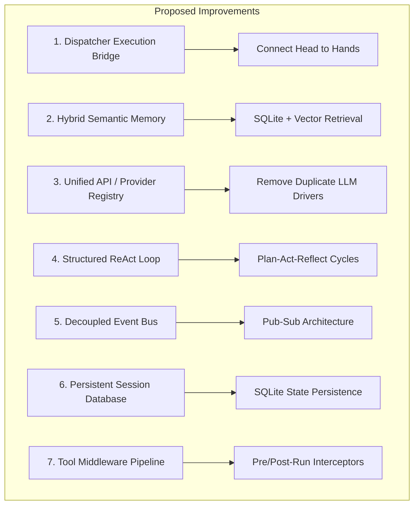

# Architectural Improvement Suggestions: N.I.A & OpenHarness

This document provides a set of architectural improvements for your AI assistant system, N.I.A (Neural Intelligence Assistant). These suggestions address crucial functional gaps, enhance scalability, unify duplicate modules, and establish agentic capabilities.

---

## Summary of Core Architectural Opportunities



---

## 1. Bridging the "Head" and "Hands" (Critical Gap)

### The Problem
There is a functional gap between N.I.A's brain/orchestration layer (the **Head**) and OpenHarness/NiaHarness's execution engine (the **Hands**):
1. In [nia.py](file:///home/kali/Desktop/N.I.A/src/agents/nia/nia.py#L212), `self._dispatcher.dispatch_batch(tool_calls)` queues task objects in the `Dispatcher`'s pending queue.
2. However, the dispatcher's [execute_pending](file:///home/kali/Desktop/N.I.A/src/agents/nia/orchestration/dispatcher.py#L92) method is never called in the lifecycle, meaning queued tasks sit in memory forever.
3. Furthermore, `Dispatcher` expects a `_tool_executor` callable to run tools, but it is `None` by default and is never wired to OpenHarness's actual [QueryEngine](file:///home/kali/Desktop/N.I.A/src/niaharness/engine/query_engine.py) or `ToolRegistry`.

### Actionable Solution: The Orchestrator Bridge
Establish a formal runtime connector that instantiates the niaharness execution components and registers them as the Dispatcher's execution backend:

```python
# Create a bridge in agents/nia/orchestration/bridge.py
from agents.nia.orchestration.dispatcher import Dispatcher
from niaharness.tools import create_default_tool_registry
from niaharness.permissions import PermissionChecker

class HarnessExecutorBridge:
    def __init__(self, dispatcher: Dispatcher, workspace_dir: str):
        self.dispatcher = dispatcher
        self.tool_registry = create_default_tool_registry()
        self.permission_checker = PermissionChecker()
        
        # Set dispatcher's executor callback to wire the Hands to the Head
        self.dispatcher.set_tool_executor(self._execute_tool_call)

    async def _execute_tool_call(self, tool_call: dict) -> dict:
        tool_name = tool_call["tool"]
        arguments = tool_call["arguments"]
        
        # 1. Resolve tool execution context
        tool = self.tool_registry.get(tool_name)
        if not tool:
            raise ValueError(f"Tool {tool_name} not found in registry")
            
        # 2. Check permissions
        is_allowed = await self.permission_checker.check(tool_name, arguments)
        if not is_allowed:
            return {"error": "Permission denied", "is_error": True}
            
        # 3. Execute
        result = await tool.execute(arguments)
        return {"output": result, "is_error": False}
```

```diff
# Integrate into agents/nia/nia.py:
  class NIA:
      def __init__(self, working_directory: str | None = None, ...):
          self._dispatcher = Dispatcher()
+         from agents.nia.orchestration.bridge import HarnessExecutorBridge
+         self._executor_bridge = HarnessExecutorBridge(self._dispatcher, self._working_directory)

      async def process(self, user_input: str) -> str:
          ...
          if tool_calls:
              tasks = self._dispatcher.dispatch_batch(tool_calls)
-             response += f"\n\nQueued {len(tasks)} task(s) for execution."
+             # Trigger execution
+             result = await self._dispatcher.execute_pending()
+             response += f"\n\nExecuted {result.tasks_succeeded} tasks."
```

---

## 2. Memory Architecture Refactoring (Hybrid Semantic Memory)

### The Problem
The current memory system in [memory.py](file:///home/kali/Desktop/N.I.A/src/agents/nia/core/memory.py) reads/writes a flat JSON file (`~/.nia/memory.json`).
* It scores relevance using basic keyword overlap: `overlap = len(words & content_words)`.
* This approach lacks semantic understanding (synonyms, contextual matching), handles spelling errors poorly, and will degrade in performance as the conversation history grows.

### Actionable Solution: SQLite with Semantic Vector Search
Transition the memory layer to a hybrid storage system:
1. **Episodic Memory**: Stored in a local relational SQLite database for queries (e.g., date-based, intent-based filtering).
2. **Semantic Memory**: Stored using an embedding search library (e.g., standard SQLite with a Python vector library like `sqlite-vec` or `chromadb`) to retrieve past interactions based on semantic similarity rather than keyword overlap.

```python
# Proposed structure for agents/nia/core/memory_v2.py
import sqlite3
import numpy as np

class SemanticMemory:
    """Manages system memory via SQLite and local vector embeddings."""
    def __init__(self, db_path: str = "~/.nia/memory.db"):
        self.conn = sqlite3.connect(db_path)
        self._init_db()

    def _init_db(self):
        # Relational schema for memories and embeddings
        self.conn.execute("""
            CREATE TABLE IF NOT EXISTS memories (
                id INTEGER PRIMARY KEY AUTOINCREMENT,
                content TEXT NOT NULL,
                category TEXT NOT NULL,
                timestamp REAL NOT NULL,
                metadata TEXT
            )
        """)
        self.conn.execute("""
            CREATE TABLE IF NOT EXISTS embeddings (
                memory_id INTEGER PRIMARY KEY,
                vector BLOB NOT NULL,
                FOREIGN KEY(memory_id) REFERENCES memories(id)
            )
        """)
        self.conn.commit()

    def add_fact(self, fact: str, embedding: np.ndarray):
        # Insert fact, then insert its float32 embedding vector
        cursor = self.conn.cursor()
        cursor.execute(
            "INSERT INTO memories (content, category, timestamp) VALUES (?, 'fact', ?)",
            (fact, time.time())
        )
        mem_id = cursor.lastrowid
        cursor.execute(
            "INSERT INTO embeddings (memory_id, vector) VALUES (?, ?)",
            (mem_id, embedding.tobytes())
        )
        self.conn.commit()

    def search_similar(self, query_embedding: np.ndarray, limit: int = 5):
        # Retrieve and calculate cosine similarity over embeddings
        ...
```

---

## 3. Unifying API Providers and registries

### The Problem
There is a division of LLM interface clients across the codebase:
* **The Head's Registry**: [ProviderRegistry](file:///home/kali/Desktop/N.I.A/src/agents/nia/providers/registry.py) wraps separate `AnthropicProvider`, `OpenAIProvider`, and `OllamaProvider` objects in `agents/nia/providers/`.
* **The Hands' Clients**: [api/client.py](file:///home/kali/Desktop/N.I.A/src/niaharness/api/client.py) (implementing `AnthropicApiClient`) and `OpenAICompatibleClient` in [api/openai_client.py](file:///home/kali/Desktop/N.I.A/src/niaharness/api/openai_client.py).

This duplication forces you to configure API keys, base URLs, and parameters twice, increasing maintenance effort and creating opportunities for synchronization issues.

### Actionable Solution: Core Provider Service
Consolidate all LLM API operations under `niaharness.providers`. The registry should serve a unified client interface implementing standard text generation, JSON structured outputs, and event streaming.

```
src/
  niaharness/
    providers/
      __init__.py
      base.py         # Defines ProviderClient protocol
      anthropic.py    # Merged Anthropic client
      openai.py       # Merged OpenAI/Ollama client
      registry.py     # Unified registry loaded by both Head and Hands
```

---

## 4. Structured Reasoning Loops (ReAct / Plan-Act-Reflect)

### The Problem
The agent processes inputs through a direct loop:
1. User input is received.
2. The model reasons in a single response generation (`self._brain.think`).
3. It queues tasks and finishes immediately.

This lacks self-correction or multi-step reasoning capabilities. If a task fails or a syntax error is introduced, the agent cannot notice the error and heal itself without user intervention.

### Actionable Solution: The ReAct Cycle
Refactor N.I.A's core process flow into an iterative **Plan-Act-Reflect** execution loop. Instead of immediately returning after queuing tasks, allow the agent to execute actions step-by-step and inspect results.

```mermaid
graph TD
    User([User Prompt]) --> Plan[Generate Plan]
    Plan --> Exec[Execute First Task]
    Exec --> Result[Inspect Task Output]
    Result --> Reflect{Did it succeed?}
    Reflect -- Yes --> Next{Any more tasks?}
    Reflect -- No --> Correct[Reflect & Auto-Correct Plan]
    Correct --> Exec
    Next -- Yes --> Exec
    Next -- No --> Response[Formulate Final Response]
    Response --> User
```



---

## 5. Robust Event Bus & Stream Architecture

### The Problem
In the current design, [backend_host.py](file:///home/kali/Desktop/N.I.A/src/agents/nia/ui/backend_host.py) directly manages communication: it captures user input, forwards it, and prints output. System components are tightly coupled. There is no unified way to listen for events (e.g., tool execution starts, budget usage alerts, retries, cost spikes) without modifying the main execution file.

### Actionable Solution: The NiaEventBus
Introduce a decoupled publish-subscribe Event Bus. All systems (Brain, Dispatcher, Tools, PermissionChecker) publish events to this bus, while frontends (Ink TUI, terminal logs, cost metrics trackers) subscribe to it.

```python
# Proposed agents/nia/core/events.py
import asyncio
from dataclasses import dataclass
from typing import Any, Callable

@dataclass
class NiaEvent:
    topic: str
    payload: dict[str, Any]

class NiaEventBus:
    def __init__(self):
        self._subscribers: dict[str, list[Callable[[NiaEvent], None]]] = {}

    def subscribe(self, topic: str, callback: Callable[[NiaEvent], None]):
        if topic not in self._subscribers:
            self._subscribers[topic] = []
          self._subscribers[topic].append(callback)

    def publish(self, topic: str, payload: dict[str, Any]):
        event = NiaEvent(topic, payload)
        # Dispatch to all matching subscribers
        for cb in self._subscribers.get(topic, []):
            if asyncio.iscoroutinefunction(cb):
                asyncio.create_task(cb(event))
            else:
                cb(event)
```

---

## 6. Persistent Session Database

### The Problem
Currently, session caches (like the dynamic `FileStateCache` that speeds up tool checks, token budgets, and current context parameters) are stored entirely in-memory. If N.I.A crashes, the process restarts, or the workspace is closed, all state metadata is lost.

### Actionable Solution: Local SQLite State Store
Store session snapshots, context attributes, file hash states, and cost accumulations in a local database file (`~/.nia/sessions.db`). 

```sql
-- Proposed SQLite database tables:
CREATE TABLE IF NOT EXISTS sessions (
    id TEXT PRIMARY KEY,
    name TEXT,
    started_at REAL NOT NULL,
    model TEXT NOT NULL,
    total_cost_usd REAL DEFAULT 0.0
);

CREATE TABLE IF NOT EXISTS file_state_cache (
    session_id TEXT,
    file_path TEXT,
    last_known_hash TEXT,
    last_modified REAL,
    PRIMARY KEY(session_id, file_path)
);
```

---

## 7. Tool Middleware Pipeline

### The Problem
Tools execute directly inside niaharness without intermediate hooks. There is no clean way to inject pre-execution checks (e.g., double checking safety constraints) or post-execution actions (e.g., automatically running `ruff format` on a python file after `FileEditTool` updates it).

### Actionable Solution: Tool Execution Pipeline
Allow registration of "Tool Middleware" interceptors. This mirrors middleware patterns in modern web frameworks (like FastAPI):

```python
# Proposed niaharness/tools/middleware.py
from typing import Callable, Awaitable

ToolExecutor = Callable[[str, dict], Awaitable[dict]]

class ToolMiddleware:
    async def __call__(self, tool_name: str, args: dict, next_call: ToolExecutor) -> dict:
        raise NotImplementedError

class AutoLintMiddleware(ToolMiddleware):
    """Post-execution middleware that runs formatting/linting on edited files."""
    async def __call__(self, tool_name: str, args: dict, next_call: ToolExecutor) -> dict:
        # 1. Run the actual tool (e.g. file edit)
        result = await next_call(tool_name, args)
        
        # 2. If it edited a python file and succeeded, trigger auto-formatting
        if tool_name in ("file_edit", "file_write") and not result.get("is_error"):
            path = args.get("file_path")
            if path and path.endswith(".py"):
                import subprocess
                subprocess.run(["black", path], capture_output=True)
                
        return result
```
