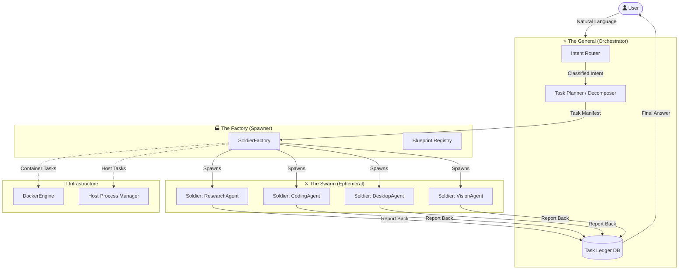
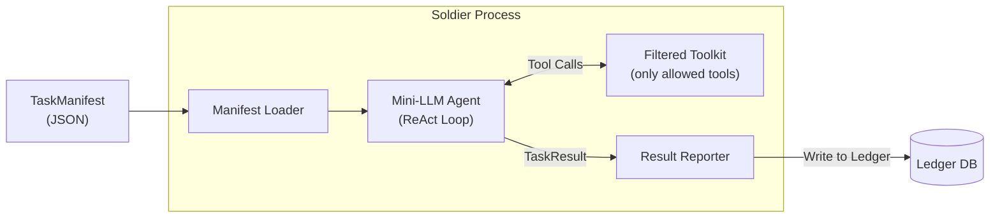
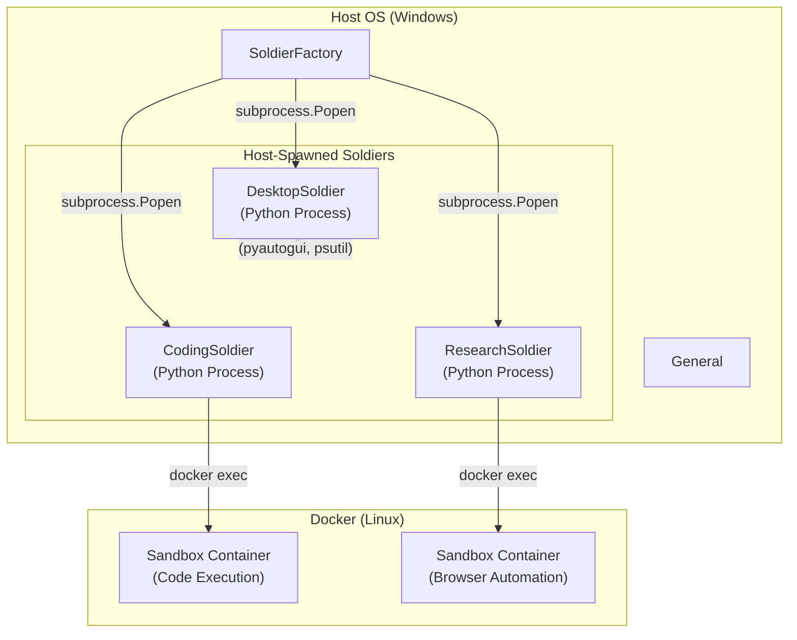
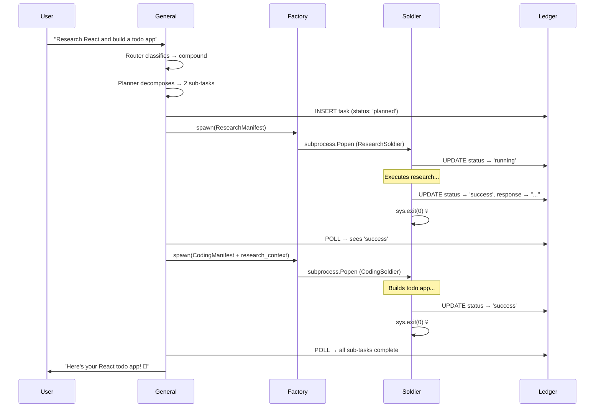

# N.I.A. Agency Architecture — "The Swarm"

**Status:** DESIGN DRAFT  
**Version:** 5.0.0 ("Swarm Edition")  
**Author:** Antigravity  
**Date:** 2026-02-15  
**Prerequisite:** [architecture_v4_docker.md](file:///c:/Users/adisi/N.I.A/docs/architecture_v4_docker.md) (Docker Sandbox layer)

---

## 0. Executive Summary

N.I.A. v5 evolves from a **Single Supervisor** (one brain, two hands) into a **Multi-Agent Orchestration System** — a General commanding an army of ephemeral Soldiers.

| Concept | v4 (Current) | v5 (Swarm) |
|:--|:--|:--|
| Topology | `NIAAssistant → SupervisorAgent → TARA / IRIS` | `General → Router → N × Soldiers` |
| Execution | Supervisor picks agent, processes in-loop | General spawns **isolated** worker processes |
| Lifecycle | Agents are long-lived singletons | Soldiers are **Born → Execute → Die** |
| Isolation | Docker optional for code execution only | Every Soldier **runs inside Docker** (or process sandbox) |
| Scaling | Sequential (one task at a time) | Concurrent (parallel Soldiers via `asyncio.gather`) |

### System Diagram — Bird's Eye View



---

## 1. Layer 1 — The Brain (Input & Routing)

### 1.1 Intent Classification (The Router)

The Router replaces the current `SupervisorAgent.process()` LLM call with a **two-stage classification** system:

#### Stage 1: Fast-Path (Zero-LLM)

A rule-based classifier catches deterministic patterns before burning an LLM call. This mirrors the existing `NIAAssistant.process()` fast-path for time/date queries.

```
FAST_ROUTES = {
    "time|date|clock":       "direct_response",
    "open|launch|start":     "desktop_agent",
    "kill|close|stop":       "desktop_agent",
    "screenshot|see|look":   "vision_agent",
}
```

If a regex/keyword match hits with confidence > 0.85 → **skip the LLM entirely**.

#### Stage 2: LLM Router (Semantic Classification)

For ambiguous or compound requests, the LLM classifies intent using a **structured output schema**:

```python
class RoutingDecision(BaseModel):
    """LLM-generated routing decision."""
    intent: Literal[
        "research",      # Web research, information gathering
        "code",          # Write, debug, or execute code
        "desktop",       # OS-level actions (open/kill apps, file ops)
        "vision",        # Screenshot analysis, visual understanding
        "conversation",  # Casual chat, Q&A, opinions
        "compound",      # Multi-step task requiring decomposition
    ]
    confidence: float           # 0.0 - 1.0
    sub_tasks: list[str] = []   # Populated only for "compound" intent
    reasoning: str              # Why this route was chosen
```

The Router lives as a new node in the `NIAGraph` LangGraph state machine, placed **before** the current supervisor node.

#### How It Maps to Agents:

| Intent | Soldier Blueprint | Execution Environment |
|:--|:--|:--|
| `research` | `ResearchSoldier` | Docker (browser automation) |
| `code` | `CodingSoldier` | Docker (sandboxed Python/Node) |
| `desktop` | `DesktopSoldier` | **Host Process** (needs OS access) |
| `vision` | `VisionSoldier` | Host Process (screen capture) |
| `conversation` | None (General handles directly) | In-process LLM call |
| `compound` | Multiple Soldiers (planned) | Mixed |

> [!IMPORTANT]
> **Compound Intent Decomposition:** When `intent == "compound"`, the Planner breaks the request into ordered sub-tasks. Each sub-task is independently routed. Example: *"Research React, then build me a todo app"* → `[ResearchSoldier("React"), CodingSoldier("build todo app")]`.

---

### 1.2 Context Passing — The Task Manifest

The General doesn't pass raw strings to Soldiers. It constructs a **Task Manifest** — a structured JSON document that is the single source of truth for a Soldier's mission.

```python
@dataclass
class TaskManifest:
    """The immutable contract between General and Soldier."""
    
    # Identity
    task_id: str                    # UUID — unique per task
    soldier_type: str               # Blueprint name (e.g., "CodingSoldier")
    parent_task_id: str | None      # For sub-tasks of compound missions
    
    # Mission
    objective: str                  # Human-readable goal
    instructions: str               # Detailed instructions from Planner
    constraints: list[str]          # Guardrails (e.g., "Do NOT modify host files")
    
    # Context
    user_query: str                 # Original user message
    memory_context: str             # Relevant memories from ChromaDB
    conversation_snippet: list[dict]# Last N messages for continuity
    session_id: str                 # Links to Docker session/volume
    
    # Resources
    tools_allowed: list[str]        # Whitelist of tool names this Soldier can use
    model_type: str                 # "smart" (GPT-4o) or "fast" (GPT-4o-mini)
    timeout_seconds: int            # Hard kill deadline
    
    # Communication
    callback_channel: str           # How to report back (see Layer 3)
```

**Delivery Mechanism:** The manifest is serialized to JSON and passed via:

| Method | When Used | Why |
|:--|:--|:--|
| **Shared File** (`data/manifests/{task_id}.json`) | Docker-based Soldiers | Container reads from mounted volume |
| **CLI Arguments** (base64-encoded JSON) | Host-Process Soldiers | Single `subprocess.Popen` call |
| **Direct Python Object** | In-process Soldiers | No serialization overhead for simple tasks |

---

## 2. Layer 2 — The Factory (Spawning Mechanism)

### 2.1 What Is a Soldier?

A Soldier is a **short-lived, single-purpose agent** with these properties:

| Property | Description |
|:--|:--|
| **Isolated** | Runs in its own process/container — cannot corrupt the General |
| **Focused** | Has access to ONLY the tools it needs (principle of least privilege) |
| **Mortal** | Born for ONE task, dies after completion (or timeout) |
| **Stateless** | All state lives in the Task Manifest and the shared Ledger |
| **Reportable** | MUST write a `TaskResult` before termination |

#### Soldier Internal Architecture



Each Soldier runs a minimal **ReAct loop** (Reason → Act → Observe → Repeat) using the LLM of choice. This is essentially a stripped-down version of the current `TARA` agent graph — but purpose-built for a single task class.

### 2.2 The Soldier Blueprint Registry

Blueprints are Python classes that define a Soldier's capabilities. They live in `src/agents/soldiers/`:

```
src/agents/soldiers/
├── __init__.py
├── base.py                 # BaseSoldier abstract class
├── research_soldier.py     # Web research specialist
├── coding_soldier.py       # Code generation/execution
├── desktop_soldier.py      # OS/app interaction
└── vision_soldier.py       # Screenshot + visual analysis
```

```python
# src/agents/soldiers/base.py

class BaseSoldier(ABC):
    """Abstract base class for all Soldiers."""
    
    # Class-level metadata
    SOLDIER_TYPE: str = "base"
    REQUIRED_TOOLS: list[str] = []
    EXECUTION_ENV: Literal["docker", "host", "inprocess"] = "docker"
    DEFAULT_TIMEOUT: int = 120
    SYSTEM_PROMPT_TEMPLATE: str = ""
    
    def __init__(self, manifest: TaskManifest):
        self.manifest = manifest
        self.toolkit = self._load_tools()
        self.llm = self._get_llm()
    
    @abstractmethod
    def execute(self) -> TaskResult:
        """Run the mission. Must return a TaskResult."""
        ...
    
    def _load_tools(self) -> list:
        """Load only the tools this soldier is allowed to use."""
        ...
    
    def _get_llm(self):
        """Get LLM instance based on manifest.model_type."""
        ...
    
    def report(self, result: TaskResult):
        """Write result to the Ledger and signal completion."""
        ...
```

### 2.3 Spawning Strategy — The Critical Decision

> **"Should the agent logic run on the Host or inside Docker?"**

#### Recommendation: **Hybrid Model** (Agent-on-Host, Sandbox-in-Docker)



**Why Hybrid?**

| Approach | Pros | Cons |
|:--|:--|:--|
| **Full Docker** (agent + tools inside container) | Maximum isolation | Expensive (each Soldier = full container), complex GPU/display passthrough, can't control Host OS |
| **Full Host** (everything on Windows) | Simple, fast spawning | Zero isolation, rogue Soldier can damage system |
| **Hybrid** (agent on Host, sandbox in Docker) | ✅ **Best of both** — fast agent startup, sandboxed execution, Host OS access when needed | Slightly more complex wiring |

**Hybrid Flow for a CodingSoldier:**

1. `SoldierFactory` spawns `CodingSoldier` as a **Host Python process** via `subprocess.Popen`
2. `CodingSoldier` reads its `TaskManifest`
3. When it needs to run code → calls `DockerEngine.run_command()` (existing infra)
4. Code executes inside the **existing Docker sandbox** (reuses v4 `DockerEngine`)
5. Results flow back through the shared volume mount
6. `CodingSoldier` writes `TaskResult` to Ledger → **process exits**

### 2.4 The SoldierFactory

```python
# src/agents/soldiers/factory.py

class SoldierFactory:
    """Spawns and manages Soldier processes."""
    
    # Blueprint registry: maps soldier_type -> class
    _blueprints: dict[str, type[BaseSoldier]] = {}
    
    @classmethod
    def register(cls, soldier_class: type[BaseSoldier]):
        """Register a Soldier blueprint."""
        cls._blueprints[soldier_class.SOLDIER_TYPE] = soldier_class
    
    @classmethod
    async def spawn(cls, manifest: TaskManifest) -> SoldierHandle:
        """
        Spawn a Soldier based on the manifest.
        
        Returns a SoldierHandle for monitoring/communication.
        """
        blueprint = cls._blueprints[manifest.soldier_type]
        
        if blueprint.EXECUTION_ENV == "inprocess":
            # Run directly in an asyncio task (lightweight)
            return await cls._spawn_inprocess(blueprint, manifest)
        
        elif blueprint.EXECUTION_ENV == "host":
            # Spawn as OS subprocess
            return await cls._spawn_process(blueprint, manifest)
        
        elif blueprint.EXECUTION_ENV == "docker":
            # Spawn inside a Docker container
            return await cls._spawn_container(blueprint, manifest)
    
    @classmethod
    async def _spawn_process(cls, blueprint, manifest) -> SoldierHandle:
        """Spawn Soldier as a subprocess on the Host."""
        # Serialize manifest
        manifest_path = f"data/manifests/{manifest.task_id}.json"
        manifest.save(manifest_path)
        
        # Launch subprocess
        proc = await asyncio.create_subprocess_exec(
            sys.executable, "-m", "src.agents.soldiers.runner",
            "--manifest", manifest_path,
            "--soldier-type", manifest.soldier_type,
            stdout=asyncio.subprocess.PIPE,
            stderr=asyncio.subprocess.PIPE,
        )
        
        return SoldierHandle(
            task_id=manifest.task_id,
            process=proc,
            soldier_type=manifest.soldier_type,
        )
```

---

## 3. Layer 3 — Communication & Termination (The Protocol)

### 3.1 The Feedback Loop — How Soldiers Report Back

#### Primary Channel: **SQLite Ledger** (Simple, Robust, Zero-Dependency)

We choose a **file-based database** instead of message queues for v5.0 because:
- Zero infrastructure overhead (no RabbitMQ/Redis to manage)
- ACID-compliant writes (no lost reports)
- Already have SQLite in the stack (`data/state.db` for LangGraph checkpoints)
- General can poll or use filesystem watchers for real-time updates

```python
@dataclass
class TaskResult:
    """The report a Soldier files before death."""
    
    task_id: str
    soldier_type: str
    status: Literal["success", "failure", "timeout", "needs_help"]
    
    # Output
    response: str               # The answer/result for the user
    artifacts: list[str]        # File paths created (e.g., code files)
    
    # Diagnostics
    tool_calls_made: int
    llm_tokens_used: int
    execution_time_seconds: float
    error_trace: str | None     # Populated on failure
    
    # Escalation
    escalation_message: str | None  # Populated when status == "needs_help"
    
    timestamp: str              # ISO 8601
```

**Ledger Schema:**

```sql
CREATE TABLE task_ledger (
    task_id         TEXT PRIMARY KEY,
    parent_task_id  TEXT,
    soldier_type    TEXT NOT NULL,
    status          TEXT NOT NULL DEFAULT 'running',
    objective       TEXT,
    response        TEXT,
    artifacts       TEXT,           -- JSON array of file paths
    tool_calls      INTEGER DEFAULT 0,
    tokens_used     INTEGER DEFAULT 0,
    exec_time       REAL DEFAULT 0.0,
    error_trace     TEXT,
    escalation_msg  TEXT,
    created_at      TEXT NOT NULL,
    completed_at    TEXT,
    
    FOREIGN KEY (parent_task_id) REFERENCES task_ledger(task_id)
);
```

#### Communication Protocol Flow:



#### Alternative Channels (Future Phases):

| Channel | Complexity | When Needed |
|:--|:--|:--|
| **SQLite Ledger** (Phase 5-6) | ⭐ Low | First implementation, synchronous polling |
| **AsyncIO Queue** (Phase 7) | ⭐⭐ Medium | In-process Soldiers, real-time streaming |
| **ZeroMQ** (Phase 8+) | ⭐⭐⭐ High | Cross-machine distribution, pub/sub patterns |
| **HTTP Webhooks** (Phase 9+) | ⭐⭐⭐ High | Cloud-deployed Soldiers, remote workers |

### 3.2 The Suicide Switch — Guaranteed Cleanup

Every Soldier **MUST** terminate cleanly. The system enforces this through three layers of defense:

#### Layer A: Self-Termination (Happy Path)

```python
# src/agents/soldiers/runner.py — the entry point for subprocess Soldiers

def main():
    """Soldier subprocess entry point."""
    manifest = load_manifest(args.manifest)
    soldier = create_soldier(manifest)
    
    try:
        result = soldier.execute()
        soldier.report(result)
    except Exception as e:
        soldier.report(TaskResult(
            task_id=manifest.task_id,
            status="failure",
            error_trace=traceback.format_exc(),
        ))
    finally:
        # CLEANUP: Remove manifest file, temp files
        cleanup_artifacts(manifest.task_id)
        # EXIT: Process dies here
        sys.exit(0)
```

#### Layer B: Timeout Watchdog (Stuck Soldiers)

The `SoldierFactory` runs a watchdog coroutine for each spawned Soldier:

```python
async def _watchdog(self, handle: SoldierHandle, timeout: int):
    """Kill Soldier if it exceeds its timeout."""
    try:
        await asyncio.wait_for(
            handle.process.wait(),
            timeout=timeout
        )
    except asyncio.TimeoutError:
        logger.warning(f"⏰ Soldier {handle.task_id} timed out! Executing kill...")
        
        # Force kill the process
        handle.process.kill()
        await handle.process.wait()
        
        # Record timeout in Ledger
        update_ledger(handle.task_id, status="timeout")
        
        # If Docker container was used, force remove it
        docker_engine.stop_session(handle.task_id)
```

#### Layer C: Periodic Reaper (Zombie Defense)

A background task in the General runs every 60 seconds to find and kill any orphaned resources:

```python
async def _reaper_loop(self):
    """Periodic cleanup of orphaned Soldiers and containers."""
    while self._running:
        await asyncio.sleep(60)
        
        # 1. Check for zombie processes
        for handle in self._active_soldiers:
            if handle.process.returncode is not None:
                # Process already dead — clean up tracking
                self._active_soldiers.remove(handle)
        
        # 2. Check for orphaned containers
        containers = docker_engine.client.containers.list(
            filters={"name": "nia-soldier-"}
        )
        for c in containers:
            task_id = c.name.replace("nia-soldier-", "")
            # If no active handle exists, this is an orphan
            if task_id not in self._active_task_ids:
                logger.warning(f"🧟 Reaping orphan container: {c.name}")
                c.kill()
                c.remove()
        
        # 3. Clean up old manifest files (> 1 hour)
        cleanup_old_manifests(max_age_hours=1)
```

**Guaranteed Cleanup Matrix:**

| Scenario | Layer A | Layer B | Layer C |
|:--|:--|:--|:--|
| Soldier completes normally | ✅ `sys.exit(0)` | — | — |
| Soldier crashes (exception) | ✅ `finally` block | — | — |
| Soldier hangs (infinite loop) | ❌ | ✅ Timeout kill | — |
| Soldier killed by OS (OOM) | ❌ | ❌ | ✅ Reaper finds zombie |
| Container orphaned (process died before cleanup) | ❌ | ❌ | ✅ Reaper kills container |

---

## 4. Implementation Strategy — The "Dhere Dhere" Plan

> *"Dhere Dhere" (धीरे धीरे) — Step by step, brick by brick.*

### Phase 5: The Router 🧭

**Goal:** Replace the monolithic `SupervisorAgent` with a dedicated Intent Router.

**Duration:** ~1 week  
**Depends On:** v4.0 Docker layer (existing)

| Task | File | Details |
|:--|:--|:--|
| Define `RoutingDecision` schema | `src/agents/nia/routing.py` **[NEW]** | Pydantic model with structured LLM output |
| Build Fast-Path classifier | `src/agents/nia/routing.py` | Regex/keyword matching for deterministic intents |
| Build LLM Router node | `src/agents/nia/routing.py` | LangChain `with_structured_output()` call |
| Integrate into `NIAGraph` | `src/agents/nia/graph/builder.py` **[MODIFY]** | Add `router` node before `supervisor` |
| Unit tests for routing | `tests/test_routing.py` **[NEW]** | Test both fast-path and LLM classification |

**Key Libraries:**
- `pydantic` — Structured output schema
- `langchain_core` — `.with_structured_output()` for the LLM router
- `re` — Fast-path regex patterns

---

### Phase 6: The Spawner 🏭

**Goal:** Build the `SoldierFactory` and `BaseSoldier` framework.

**Duration:** ~1.5 weeks  
**Depends On:** Phase 5 (Router decides what to spawn)

| Task | File | Details |
|:--|:--|:--|
| Define `TaskManifest` | `src/agents/soldiers/manifest.py` **[NEW]** | Dataclass + JSON serialization |
| Define `TaskResult` | `src/agents/soldiers/result.py` **[NEW]** | Dataclass for Soldier output |
| Build `BaseSoldier` ABC | `src/agents/soldiers/base.py` **[NEW]** | Abstract class with `execute()`, `report()` |
| Build `SoldierFactory` | `src/agents/soldiers/factory.py` **[NEW]** | Blueprint registry + `spawn()` methods |
| Build `runner.py` entry point | `src/agents/soldiers/runner.py` **[NEW]** | `__main__` that loads manifest and runs Soldier |
| Build Task Ledger (SQLite) | `src/agents/soldiers/ledger.py` **[NEW]** | CRUD operations for `task_ledger` table |
| Create first Soldier: `ConversationSoldier` | `src/agents/soldiers/conversation_soldier.py` **[NEW]** | Trivial Soldier for testing — just LLM chat |
| Wire Factory into General | `src/core/engine/orchestrator.py` **[MODIFY]** | Replace direct agent calls with Factory spawns |
| Integration tests | `tests/test_spawner.py` **[NEW]** | End-to-end: manifest → spawn → result |

**Key Libraries:**
- `asyncio` — `create_subprocess_exec()` for Host process spawning
- `sqlite3` / `aiosqlite` — Task Ledger
- `dataclasses` + `json` — Manifest serialization
- `subprocess` — Process lifecycle

**New Directory Structure:**

```
src/agents/soldiers/
├── __init__.py
├── base.py               # BaseSoldier ABC
├── factory.py             # SoldierFactory
├── runner.py              # Subprocess entry point
├── manifest.py            # TaskManifest dataclass
├── result.py              # TaskResult dataclass
├── ledger.py              # SQLite Ledger CRUD
├── conversation_soldier.py # First Soldier (chat only)
├── desktop_soldier.py     # Phase 7
├── coding_soldier.py      # Phase 7
├── research_soldier.py    # Phase 8
└── vision_soldier.py      # Phase 8
```

---

### Phase 7: The Swarm ⚔️

**Goal:** Build real-world Soldiers and enable parallel execution.

**Duration:** ~2 weeks  
**Depends On:** Phase 6 (Factory framework)

| Task | File | Details |
|:--|:--|:--|
| `DesktopSoldier` | `src/agents/soldiers/desktop_soldier.py` **[NEW]** | Wraps existing TARA desktop tools (`pyautogui`, `psutil`) |
| `CodingSoldier` | `src/agents/soldiers/coding_soldier.py` **[NEW]** | Wraps `DockerEngine.run_command()` for sandboxed code execution |
| Compound Task Planner | `src/agents/nia/planner.py` **[NEW]** | Decomposes compound intents into ordered sub-tasks |
| Parallel Spawner | `src/agents/soldiers/factory.py` **[MODIFY]** | `asyncio.gather()` for independent sub-tasks |
| Timeout Watchdog | `src/agents/soldiers/factory.py` **[MODIFY]** | Per-Soldier watchdog coroutine |
| Reaper Background Task | `src/core/engine/orchestrator.py` **[MODIFY]** | Periodic zombie/orphan cleanup |
| Register in ServiceRegistry | `main.py` **[MODIFY]** | Register `SoldierFactory` as a service |
| Stress tests | `tests/test_swarm.py` **[NEW]** | Spawn 5 concurrent Soldiers, verify all complete |

**Key Libraries:**
- `asyncio` — `gather()`, `wait_for()`, `create_subprocess_exec()`
- `docker` (docker-py) — Reuse existing `DockerEngine`
- `signal` — Graceful shutdown signaling

---

### Phase 8: Intelligence Expansion 🧠

**Goal:** Add specialized Soldiers and advanced communication.

**Duration:** ~2 weeks  
**Depends On:** Phase 7 (Core Swarm working)

| Task | Details |
|:--|:--|
| `ResearchSoldier` | Web browsing via headless Chromium in Docker |
| `VisionSoldier` | Screen capture + `IrisAgent` analysis |
| `Soldier-to-Soldier` communication | One Soldier can spawn sub-Soldiers |
| Streaming results | AsyncIO Queue for real-time output to user |
| Advanced Planner | DAG-based task dependencies (not just sequential) |

---

### Phase 9: Hardening & Scale 🔒

**Goal:** Production-grade reliability.

| Task | Details |
|:--|:--|
| Resource limits | CPU / Memory caps per Soldier (Docker `--cpus`, `--memory`) |
| Retry logic | Auto-retry failed Soldiers (max 2 retries) |
| Observability | Structured logging per Soldier, centralized in `logs/soldiers/` |
| Cost tracking | Token usage per Soldier, budget enforcement |
| Migrate to ZeroMQ | For cross-process real-time messaging (if needed) |

---

## 5. File Structure — Full View

```
N.I.A/
├── src/
│   ├── agents/
│   │   ├── nia/
│   │   │   ├── agent.py            # SupervisorAgent (gradually deprecated)
│   │   │   ├── routing.py          # [NEW] Intent Router
│   │   │   ├── planner.py          # [NEW] Task Decomposer
│   │   │   ├── graph/
│   │   │   │   └── builder.py      # [MODIFY] Add router node
│   │   │   └── state.py            # [MODIFY] Add routing fields
│   │   │
│   │   ├── soldiers/               # [NEW] Entire directory
│   │   │   ├── __init__.py
│   │   │   ├── base.py             # BaseSoldier ABC
│   │   │   ├── factory.py          # SoldierFactory + Watchdog
│   │   │   ├── runner.py           # Subprocess entry point
│   │   │   ├── manifest.py         # TaskManifest
│   │   │   ├── result.py           # TaskResult
│   │   │   ├── ledger.py           # SQLite Ledger
│   │   │   ├── conversation_soldier.py
│   │   │   ├── desktop_soldier.py
│   │   │   ├── coding_soldier.py
│   │   │   ├── research_soldier.py
│   │   │   └── vision_soldier.py
│   │   │
│   │   ├── tara/                   # Existing (tools become Soldier capabilities)
│   │   └── iris/                   # Existing (VisionSoldier wraps this)
│   │
│   ├── core/
│   │   ├── engine/
│   │   │   └── orchestrator.py     # [MODIFY] The General lives here
│   │   ├── registry.py             # ServiceRegistry (unchanged)
│   │   └── events.py               # AsyncEventBus (unchanged)
│   │
│   └── infrastructure/
│       ├── container_engine/        # DockerEngine (reused by Soldiers)
│       └── host_os/                 # HostProcessManager (reused by DesktopSoldier)
│
├── data/
│   ├── manifests/                   # [NEW] Task manifests (ephemeral)
│   ├── ledger.db                    # [NEW] Task Ledger SQLite
│   └── sandbox_mounts/             # Existing Docker volume mounts
│
├── logs/
│   └── soldiers/                    # [NEW] Per-Soldier log files
│
└── tests/
    ├── test_routing.py              # [NEW]
    ├── test_spawner.py              # [NEW]
    └── test_swarm.py                # [NEW]
```

---

## 6. Migration Strategy — Backward Compatibility

The swarm architecture is **additive**, not destructive. We preserve every existing system:

| Current System | Fate | Details |
|:--|:--|:--|
| `SupervisorAgent` | **Demoted** | Becomes a helper inside the Router (Phase 5). Eventually deprecated |
| `TARA` graph + tools | **Absorbed** | Tool functions become Soldier capabilities. `TaraTool` protocol stays |
| `IRIS` agent | **Wrapped** | `VisionSoldier` delegates to `IrisAgent.process()` internally |
| `DockerEngine` | **Shared** | Soldiers use existing container infra — no duplication |
| `ServiceRegistry` | **Extended** | `SoldierFactory` registers as a service |
| `AsyncEventBus` | **Extended** | New events: `soldier_spawned`, `soldier_completed`, `soldier_failed` |
| `NIAGraph` | **Extended** | New nodes: `router`, `planner`, `spawner` |

> [!NOTE]
> **The General is NOT a new entity.** It is the **evolved** `NIAAssistant` + `NIAGraph`. We add capabilities to the existing orchestrator rather than replacing it.

---

## 7. Technology Reference

| Component | Library | Version | Purpose |
|:--|:--|:--|:--|
| Agent Framework | `langgraph` | 0.x | State machine for General, ReAct loops for Soldiers |
| LLM Integration | `langchain-core`, `langchain-openai` | latest | LLM calls with structured output |
| Structured Output | `pydantic` | 2.x | `RoutingDecision`, `TaskManifest`, `TaskResult` schemas |
| Process Spawning | `asyncio` (stdlib) | 3.11+ | `create_subprocess_exec()` for Host Soldiers |
| Container Engine | `docker` (docker-py) | 7.x | Reuse existing `DockerEngine` |
| Task Ledger | `aiosqlite` | latest | Async SQLite for Ledger |
| Shared State | `sqlite3` (stdlib) | — | LangGraph checkpoints + Ledger |
| Logging | `logging` (stdlib) | — | Per-Soldier log files |
| Desktop Automation | `pyautogui`, `psutil` | existing | Reused by `DesktopSoldier` |
| Web/Research | `playwright` or `selenium` | TBD | Browser automation inside Docker |
| CLI Parsing | `argparse` (stdlib) | — | `runner.py` argument handling |
| FastAPI | `fastapi` | optional, Phase 9+ | HTTP webhook endpoint for remote Soldiers |
| Task Queue | `celery` | optional, Phase 9+ | Distributed task scheduling (cloud scale) |

---

## 8. Open Questions & Design Decisions

| # | Question | Current Recommendation | Needs User Input? |
|:--|:--|:--|:--|
| 1 | Should `DesktopSoldier` run in-process (faster) or subprocess (safer)? | Subprocess — isolation matters more. `pyautogui` import is cheap | ⚠️ Yes |
| 2 | Max concurrent Soldiers? | 5 initially (configurable via `config.yaml`) | No |
| 3 | Should Soldiers share a single Docker session or each get their own? | Shared session per compound task, unique per independent task | No |
| 4 | How to handle Soldier-to-Soldier dependencies? | Sequential execution in Phase 7, DAG scheduler in Phase 8 | No |
| 5 | Token budget per Soldier? | 4096 tokens for `fast`, 8192 for `smart`, configurable | ⚠️ Yes |
| 6 | Should we use `celery` for task queuing? | **No** — overkill for v5.0. `asyncio` is sufficient. Revisit in Phase 9 | No |

---

*"One General. Many Soldiers. Zero Survivors."*  
— N.I.A. v5.0 Swarm Protocol
