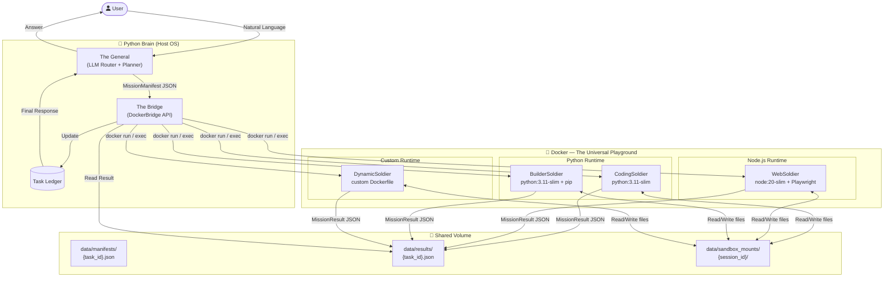
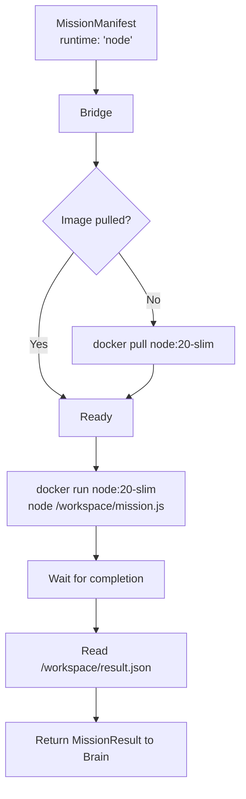
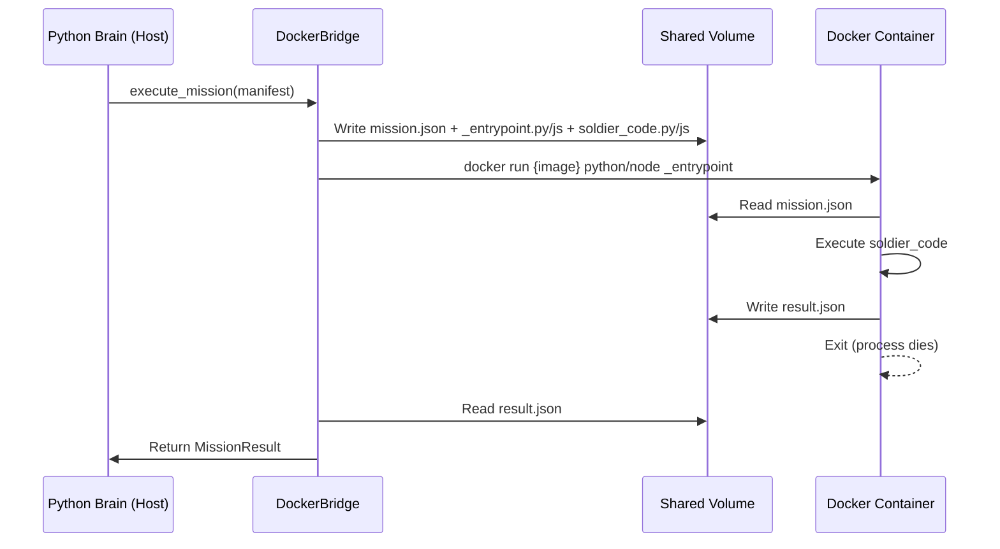
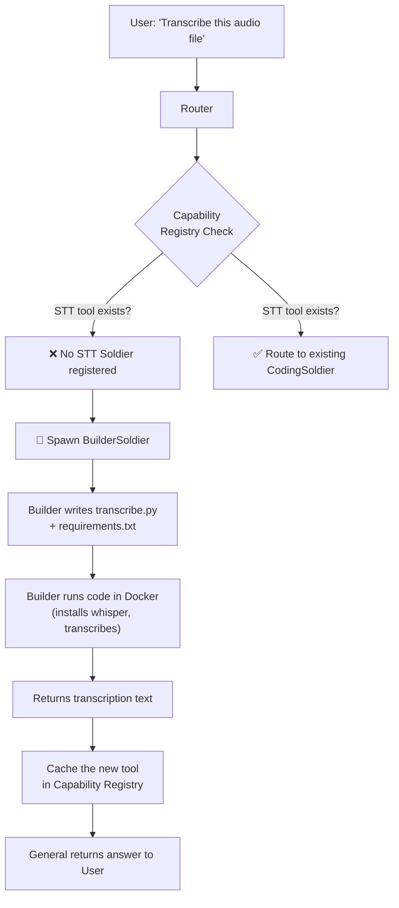
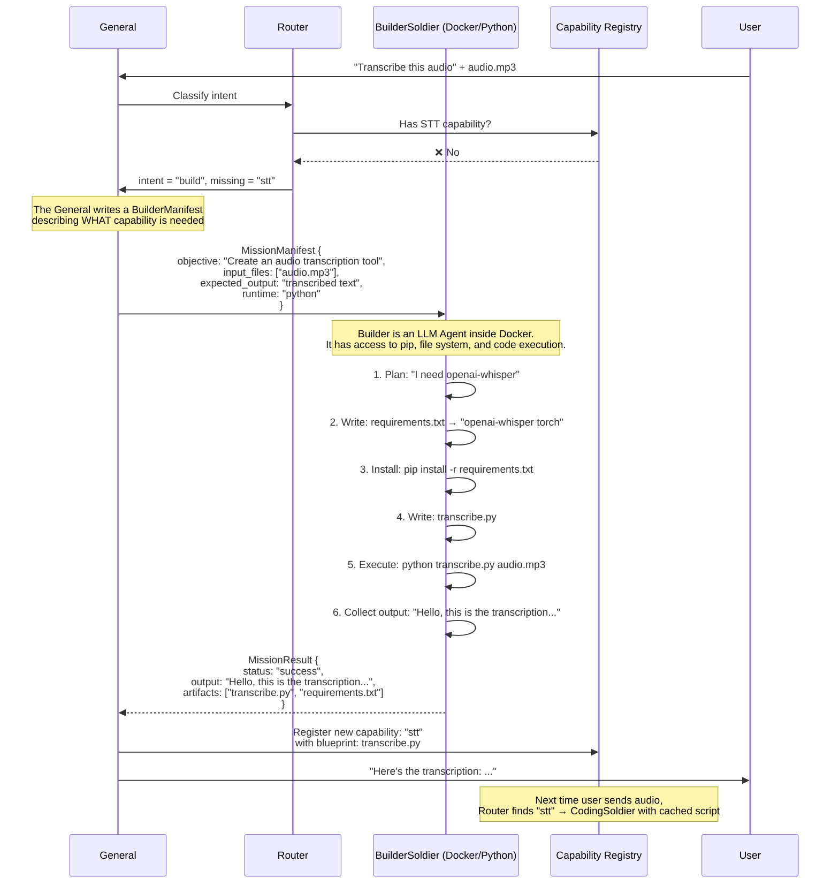
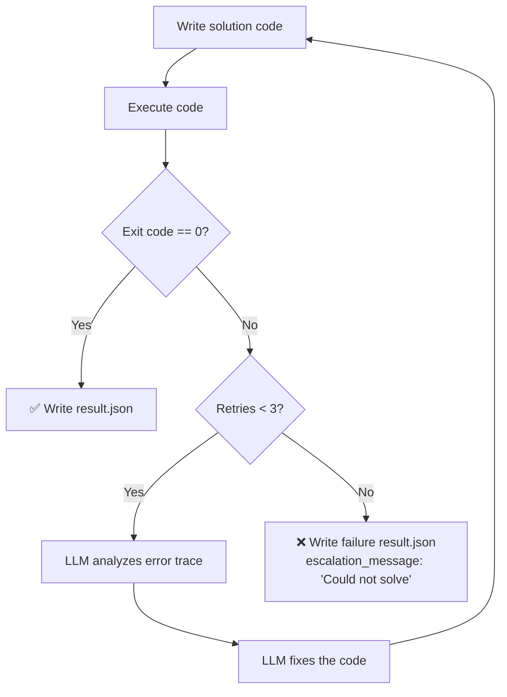
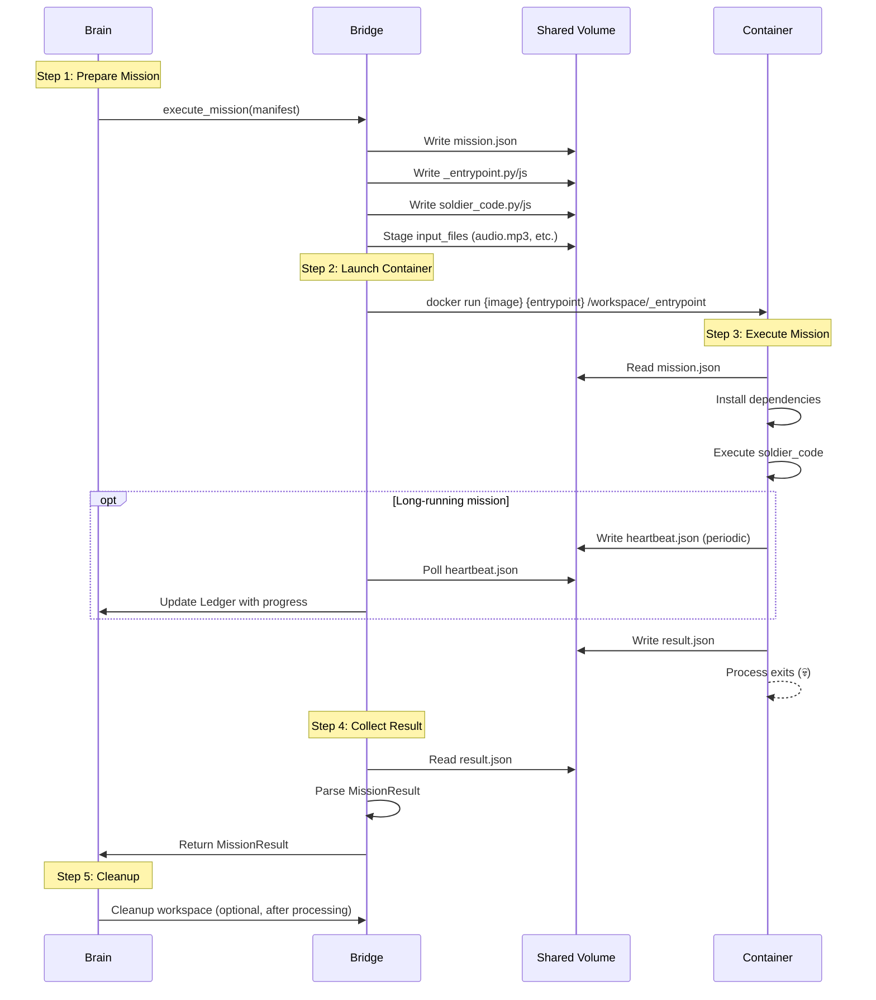
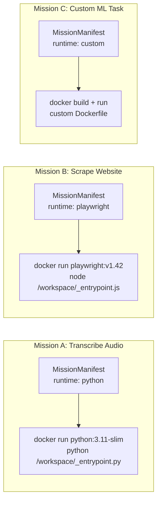

# N.I.A. Polyglot AGI Architecture — "The Universal Soldier"

**Status:** DESIGN DRAFT  
**Version:** 5.0.0 ("Polyglot Swarm")  
**Author:** Antigravity  
**Date:** 2026-02-15  
**Prerequisites:**
- [AGENCY_ARCHITECTURE.md](file:///c:/Users/adisi/N.I.A/docs/AGENCY_ARCHITECTURE.md) — The Swarm framework (General/Soldier pattern)
- [architecture_v4_docker.md](file:///c:/Users/adisi/N.I.A/docs/architecture_v4_docker.md) — Docker Sandbox layer

---

## 0. Executive Summary — The Polyglot Vision

N.I.A. v5.0 is not just multi-agent — it is **multi-language, multi-runtime, and self-extending**.

The system can:
1. **Execute Python** (data science, ML, scripting) inside Docker
2. **Execute Node.js / TypeScript** (web scraping, Playwright automation) inside Docker
3. **Build its own tools at runtime** when it encounters a capability gap (the AGI feature)
4. All orchestrated by a **Python Brain on the Host** that speaks JSON to Docker containers

| Concept | v4 (Docker Sandbox) | v5 (Polyglot Swarm) |
|:--|:--|:--|
| Language | Python only | Python + Node.js + any language |
| Image | `python:3.11-slim` (hardcoded) | Multi-image registry (dynamic) |
| Capability | Fixed tool set | **Self-generating** (Builder Soldier) |
| IPC | Return tuple `(exit_code, stdout, stderr)` | **Structured JSON Schema** (MissionManifest → MissionResult) |
| Container Lifecycle | Ephemeral OR Session | **Mission-scoped**: spawn per mission, die on completion |

### System Diagram — The Polyglot Swarm



---

## 1. The Stack — Python Brain, Docker Body, JSON Bridge

### 1.1 The Brain (Python 🐍) — Host Side

The Brain is **pure orchestration**. It runs on the Host OS (Windows) and **never** executes untrusted code.

| Component | File | Role |
|:--|:--|:--|
| The General | `src/core/engine/orchestrator.py` | User interface, conversation loop |
| Intent Router | `src/agents/nia/routing.py` [NEW] | Classifies intent → picks Soldier type |
| Task Planner | `src/agents/nia/planner.py` [NEW] | Decomposes compound tasks into sub-missions |
| **DockerBridge** | `src/infrastructure/container_engine/bridge.py` [NEW] | The critical Python↔Docker interface |
| Soldier Factory | `src/agents/soldiers/factory.py` [NEW] | Spawns Soldiers via DockerBridge |
| Task Ledger | `src/agents/soldiers/ledger.py` [NEW] | SQLite tracking of all missions |

**The Brain's Golden Rule:** *"Think on Host. Execute in Docker. Trust no output."*

### 1.2 The Body (Docker 🐳) — Container Side

Docker is the "universal playground" where ALL code execution happens. The critical innovation is **multi-runtime support** — the same `DockerBridge` can start a Python container, a Node.js container, or a custom-built container.

#### Runtime Image Registry

```python
# src/infrastructure/container_engine/images.py [NEW]

RUNTIME_REGISTRY: dict[str, RuntimeImage] = {
    "python": RuntimeImage(
        image="python:3.11-slim",
        entrypoint="python",
        install_cmd="pip install --no-cache-dir",
        healthcheck="python --version",
        description="Python 3.11 for data science, ML, scripting",
    ),
    "node": RuntimeImage(
        image="node:20-slim",
        entrypoint="node",
        install_cmd="npm install --no-save",
        healthcheck="node --version",
        description="Node.js 20 for web automation, TypeScript, APIs",
    ),
    "playwright": RuntimeImage(
        image="mcr.microsoft.com/playwright:v1.42.0-jammy",
        entrypoint="npx",
        install_cmd="npm install --no-save",
        healthcheck="npx playwright --version",
        description="Playwright + Chromium for browser automation",
    ),
    "bash": RuntimeImage(
        image="alpine:3.19",
        entrypoint="sh",
        install_cmd="apk add --no-cache",
        healthcheck="echo ok",
        description="Lightweight shell for simple commands",
    ),
}
```

```python
@dataclass
class RuntimeImage:
    """Metadata for a Docker runtime environment."""
    image: str              # Docker image tag
    entrypoint: str         # Default command interpreter
    install_cmd: str        # Package install prefix
    healthcheck: str        # Verify runtime is working
    description: str        # Human-readable purpose
    
    # Optional: Pre-built custom image (for Builder Soldier outputs)
    custom_dockerfile: str | None = None
```

#### How the Body Switches Runtimes

The current `DockerEngine.run_command()` takes an `image` parameter but always defaults to `python:3.11-slim`. The Polyglot extension makes `image` selection **dynamic and mission-driven**:



### 1.3 The Bridge — Python ↔ Docker ↔ Any Language

**This is the most critical component.** The Bridge is the universal adapter between the Python Host and any container runtime.

#### The Problem

```
Host (Python)  →  "Execute this TypeScript web scraper"  →  Container (Node.js)
Host (Python)  ←  "Here's the scraped JSON data"          ←  Container (Node.js)
```

How do you call TypeScript from Python and get structured data back?

#### The Solution: File-Based JSON Protocol

Instead of complex IPC (sockets, gRPC, ZeroMQ), we use the **shared volume mount** that already exists (`data/sandbox_mounts/{session_id}/`):

```
Host writes:    data/sandbox_mounts/{session_id}/mission.json    ← MissionManifest
Container reads:  /workspace/mission.json                        ← Same file (mounted)
Container writes: /workspace/result.json                         ← MissionResult
Host reads:     data/sandbox_mounts/{session_id}/result.json     ← Same file (mounted)
```

**Zero network dependencies. Zero new infrastructure. Works with ANY language that can read/write JSON.**

#### DockerBridge Implementation

```python
# src/infrastructure/container_engine/bridge.py [NEW]

class DockerBridge:
    """The universal Python ↔ Docker communication layer.
    
    Handles:
    - Runtime selection (Python, Node.js, custom)
    - Manifest delivery via shared volume
    - Result collection via JSON file
    - Timeout enforcement
    - Container lifecycle (spawn → wait → collect → kill)
    """
    
    def __init__(self, engine: DockerEngine):
        self.engine = engine
        self.manifests_dir = Path("data/manifests")
        self.results_dir = Path("data/results")
    
    async def execute_mission(
        self,
        manifest: MissionManifest,
        timeout: int = 120,
    ) -> MissionResult:
        """
        Execute a mission in a Docker container.
        
        1. Write manifest to shared volume
        2. Spawn container with correct runtime
        3. Wait for result.json (or timeout)
        4. Parse and return MissionResult
        """
        session_id = manifest.task_id
        runtime = RUNTIME_REGISTRY[manifest.runtime]
        
        # --- Step 1: Prepare the workspace ---
        workspace = self._prepare_workspace(session_id, manifest)
        
        # --- Step 2: Write manifest to shared volume ---
        manifest_path = workspace / "mission.json"
        manifest_path.write_text(manifest.to_json())
        
        # --- Step 3: Write the entrypoint script ---
        # The entrypoint is a language-specific wrapper that:
        #   a) Reads mission.json
        #   b) Executes the mission logic
        #   c) Writes result.json
        entrypoint_path = self._write_entrypoint(workspace, manifest, runtime)
        
        # --- Step 4: Run the container ---
        mounts = {
            str(workspace.absolute()): {
                'bind': '/workspace',
                'mode': 'rw'
            }
        }
        
        # Build the command based on runtime
        command = self._build_command(manifest, runtime, entrypoint_path)
        
        exit_code, stdout, stderr = self.engine.run_command(
            image=runtime.image,
            command=command,
            session_id=session_id,
            mounts=mounts,
        )
        
        # --- Step 5: Collect the result ---
        result_path = workspace / "result.json"
        
        if result_path.exists():
            result = MissionResult.from_json(result_path.read_text())
        else:
            # Container didn't write a result — build one from stdout/stderr
            result = MissionResult(
                task_id=manifest.task_id,
                status="failure" if exit_code != 0 else "success",
                output=stdout,
                error=stderr,
                exit_code=exit_code,
            )
        
        return result
    
    def _write_entrypoint(
        self,
        workspace: Path,
        manifest: MissionManifest,
        runtime: RuntimeImage,
    ) -> Path:
        """Generate the entrypoint script for the target runtime."""
        
        if manifest.runtime == "python":
            return self._write_python_entrypoint(workspace, manifest)
        elif manifest.runtime in ("node", "playwright"):
            return self._write_node_entrypoint(workspace, manifest)
        else:
            return self._write_bash_entrypoint(workspace, manifest)
    
    def _write_python_entrypoint(self, workspace: Path, manifest: MissionManifest) -> Path:
        """Generate a Python entrypoint wrapper."""
        script = workspace / "_entrypoint.py"
        script.write_text(f'''
import json
import sys
import traceback

def main():
    # Load mission
    with open("/workspace/mission.json") as f:
        mission = json.load(f)
    
    result = {{"task_id": mission["task_id"], "status": "success", "output": "", "error": None, "exit_code": 0, "artifacts": []}}
    
    try:
        # Execute the mission code
        exec(open("/workspace/soldier_code.py").read(), {{"__name__": "__main__", "mission": mission, "result": result}})
    except Exception as e:
        result["status"] = "failure"
        result["error"] = traceback.format_exc()
        result["exit_code"] = 1
    
    # Write result
    with open("/workspace/result.json", "w") as f:
        json.dump(result, f, indent=2)

if __name__ == "__main__":
    main()
''')
        
        # Also write the actual Soldier code
        code_file = workspace / "soldier_code.py"
        code_file.write_text(manifest.code)
        
        return script
    
    def _write_node_entrypoint(self, workspace: Path, manifest: MissionManifest) -> Path:
        """Generate a Node.js entrypoint wrapper."""
        script = workspace / "_entrypoint.js"
        script.write_text('''
const fs = require('fs');
const path = require('path');

async function main() {
    const mission = JSON.parse(fs.readFileSync('/workspace/mission.json', 'utf8'));
    
    const result = {
        task_id: mission.task_id,
        status: 'success',
        output: '',
        error: null,
        exit_code: 0,
        artifacts: [],
    };
    
    try {
        // Execute the mission code
        const soldierModule = require('/workspace/soldier_code.js');
        
        if (typeof soldierModule === 'function') {
            const output = await soldierModule(mission);
            result.output = typeof output === 'string' ? output : JSON.stringify(output);
        } else if (typeof soldierModule.run === 'function') {
            const output = await soldierModule.run(mission);
            result.output = typeof output === 'string' ? output : JSON.stringify(output);
        }
    } catch (e) {
        result.status = 'failure';
        result.error = e.stack || e.message;
        result.exit_code = 1;
    }
    
    fs.writeFileSync('/workspace/result.json', JSON.stringify(result, null, 2));
}

main().catch(err => {
    fs.writeFileSync('/workspace/result.json', JSON.stringify({
        task_id: 'unknown',
        status: 'failure',
        error: err.stack,
        exit_code: 1,
    }, null, 2));
    process.exit(1);
});
''')
        
        # Write the actual Soldier code
        code_file = workspace / "soldier_code.js"
        code_file.write_text(manifest.code)
        
        return script
    
    def _build_command(self, manifest: MissionManifest, runtime: RuntimeImage, entrypoint: Path) -> str:
        """Build the shell command to run inside the container."""
        
        # Install dependencies first, then run
        install_steps = ""
        if manifest.dependencies:
            deps = " ".join(manifest.dependencies)
            install_steps = f"{runtime.install_cmd} {deps} && "
        
        if manifest.runtime == "python":
            return f"bash -c '{install_steps}python /workspace/_entrypoint.py'"
        elif manifest.runtime in ("node", "playwright"):
            return f"bash -c '{install_steps}node /workspace/_entrypoint.js'"
        else:
            return f"bash -c '{install_steps}sh /workspace/_entrypoint.sh'"
```

#### Bridge Flow Summary:



---

## 2. The Builder Workflow — The AGI Feature

This is the crown jewel. The **Builder Soldier** is a meta-agent: an agent that **writes other agents** at runtime.

### 2.1 When Does the Builder Activate?

The Router detects a **capability gap** — a task that no existing Soldier can handle.



### 2.2 The Builder Soldier — Detailed Flow



### 2.3 The Capability Registry

The Capability Registry is a persistent store of known tools and learned capabilities:

```python
# src/agents/soldiers/capability_registry.py [NEW]

@dataclass  
class Capability:
    """A registered system capability."""
    name: str               # e.g., "stt", "web_scraper", "pdf_parser"
    description: str        # Human-readable description
    runtime: str            # "python", "node", "playwright"
    
    # The code to execute this capability
    script_path: str        # Relative path in data/capabilities/{name}/
    dependencies: list[str] # pip/npm packages required
    
    # Metadata
    created_by: str         # "builtin" or "builder_{task_id}"
    created_at: str         # ISO 8601
    times_used: int = 0     # Usage counter
    last_used: str = ""     # ISO 8601
    
    # Input/Output contract
    input_schema: dict      # What this capability expects
    output_schema: dict     # What this capability returns


class CapabilityRegistry:
    """
    Persistent registry of all system capabilities.
    
    Stores:
    - Builtin capabilities (shipped with N.I.A.)
    - Learned capabilities (created by Builder Soldiers)
    """
    
    REGISTRY_FILE = Path("data/capabilities/registry.json")
    CAPABILITIES_DIR = Path("data/capabilities/")
    
    def has(self, name: str) -> bool:
        """Check if a capability exists."""
        ...
    
    def search(self, query: str) -> list[Capability]:
        """Semantic search for capabilities matching a query."""
        ...
    
    def register(self, capability: Capability, script_content: str):
        """Register a new capability (from Builder output)."""
        # Save script to data/capabilities/{name}/script.py
        # Update registry.json
        ...
    
    def get_manifest_for(self, name: str, input_data: dict) -> MissionManifest:
        """Generate a MissionManifest to execute an existing capability."""
        ...
```

#### Capability Storage Layout

```
data/capabilities/
├── registry.json                   # Master index
├── stt/                            # Learned capability
│   ├── script.py                   # transcribe.py (Builder output)
│   ├── requirements.txt            # openai-whisper torch
│   └── metadata.json               # Input/output schemas
├── pdf_parser/                     # Another learned capability
│   ├── script.py
│   ├── requirements.txt
│   └── metadata.json
└── web_scraper/                    # Builtin capability
    ├── script.js                   # Node.js scraper
    ├── package.json
    └── metadata.json
```

### 2.4 The Builder Soldier's Internal LLM Loop

The Builder Soldier is itself an LLM-powered agent running inside Docker. It has a **ReAct loop** with three tools:

| Tool | Description |
|:--|:--|
| `write_file(path, content)` | Write files to `/workspace/` |
| `run_shell(command)` | Execute shell commands (pip install, python, node, etc.) |
| `read_file(path)` | Read file contents (for debugging output) |

```python
BUILDER_SYSTEM_PROMPT = """
You are a Builder Soldier inside a Docker container.
Your mission is to CREATE a working solution for the objective described in /workspace/mission.json.

RULES:
1. Read the mission objective carefully.
2. Plan what code, libraries, and approach you need.
3. Write a requirements.txt (or package.json) with the dependencies you need.
4. Install dependencies using the appropriate package manager.
5. Write the solution code.
6. Execute the code and verify it works.
7. Write the result to /workspace/result.json.

You have access to:
- Full internet access (for pip install, npm install, downloading models)
- Python 3.11, pip, bash
- Read/write access to /workspace/

IMPORTANT: Your output code should be REUSABLE. Write clean, documented code
that can be cached and reused for future similar tasks.
"""
```

### 2.5 Self-Correction Loop

If the Builder's first attempt fails, it retries with error context:



---

## 3. The Communication Protocol — JSON Schema

### 3.1 MissionManifest (Brain → Soldier)

The **immutable contract** between the General and any Soldier.

```json
{
    "$schema": "https://json-schema.org/draft/2020-12/schema",
    "title": "MissionManifest",
    "description": "The mission briefing passed from the General to a Soldier",
    "type": "object",
    "required": ["task_id", "soldier_type", "runtime", "objective"],
    "properties": {
        
        "task_id": {
            "type": "string",
            "format": "uuid",
            "description": "Unique mission identifier"
        },
        "parent_task_id": {
            "type": ["string", "null"],
            "description": "Parent task ID for sub-missions of compound tasks"
        },
        "soldier_type": {
            "type": "string",
            "enum": ["coding", "web", "builder", "desktop", "vision", "conversation"],
            "description": "Which Soldier blueprint to use"
        },
        "runtime": {
            "type": "string",
            "enum": ["python", "node", "playwright", "bash", "custom"],
            "description": "Docker runtime environment"
        },
        
        "objective": {
            "type": "string",
            "description": "Human-readable goal (fed to Soldier's LLM as the task)"
        },
        "instructions": {
            "type": "string",
            "default": "",
            "description": "Detailed step-by-step instructions from the Planner"
        },
        "constraints": {
            "type": "array",
            "items": { "type": "string" },
            "default": [],
            "description": "Guardrails and restrictions"
        },
        
        "code": {
            "type": "string",
            "default": "",
            "description": "Pre-written code to execute (empty for Builder — it writes its own)"
        },
        "dependencies": {
            "type": "array",
            "items": { "type": "string" },
            "default": [],
            "description": "Packages to install before execution (e.g., 'openai-whisper', 'playwright')"
        },
        "input_files": {
            "type": "array",
            "items": { "type": "string" },
            "default": [],
            "description": "Files pre-staged in /workspace/ for the Soldier to use"
        },
        
        "user_query": {
            "type": "string",
            "description": "Original user message (for context)"
        },
        "memory_context": {
            "type": "string",
            "default": "",
            "description": "Relevant memories from ChromaDB"
        },
        "conversation_snippet": {
            "type": "array",
            "items": {
                "type": "object",
                "properties": {
                    "role": { "type": "string" },
                    "content": { "type": "string" }
                }
            },
            "default": [],
            "description": "Last N conversation messages for continuity"
        },
        
        "model_type": {
            "type": "string",
            "enum": ["smart", "fast"],
            "default": "fast",
            "description": "LLM tier for the Soldier's internal reasoning"
        },
        "timeout_seconds": {
            "type": "integer",
            "default": 120,
            "minimum": 10,
            "maximum": 600,
            "description": "Hard kill deadline"
        },
        "max_retries": {
            "type": "integer",
            "default": 2,
            "description": "Max self-correction attempts (Builder Soldier)"
        },
        
        "callback_url": {
            "type": ["string", "null"],
            "default": null,
            "description": "Optional HTTP webhook for real-time updates (Phase 9+)"
        },
        
        "created_at": {
            "type": "string",
            "format": "date-time"
        }
    }
}
```

### 3.2 SoldierHeartbeat (Soldier → Brain, Optional)

For long-running missions, the Soldier can write periodic heartbeats to signal it's alive:

```json
{
    "$schema": "https://json-schema.org/draft/2020-12/schema",
    "title": "SoldierHeartbeat",
    "description": "Periodic status update from a running Soldier",
    "type": "object",
    "required": ["task_id", "status", "progress", "timestamp"],
    "properties": {
        "task_id": {
            "type": "string",
            "format": "uuid"
        },
        "status": {
            "type": "string",
            "enum": ["running", "installing_deps", "executing", "retrying", "finalizing"],
            "description": "Current phase of execution"
        },
        "progress": {
            "type": "number",
            "minimum": 0.0,
            "maximum": 1.0,
            "description": "Estimated progress (0.0 to 1.0)"
        },
        "current_step": {
            "type": "string",
            "description": "Human-readable description of current action"
        },
        "tool_calls_made": {
            "type": "integer",
            "default": 0
        },
        "tokens_used": {
            "type": "integer",
            "default": 0
        },
        "timestamp": {
            "type": "string",
            "format": "date-time"
        }
    }
}
```

**Heartbeat Delivery:** Written to `/workspace/heartbeat.json` (same shared volume). The Bridge can poll this file to update the Ledger and inform the user of progress.

### 3.3 MissionResult (Soldier → Brain)

The **final report** before the Soldier dies.

```json
{
    "$schema": "https://json-schema.org/draft/2020-12/schema",
    "title": "MissionResult",
    "description": "The final output from a Soldier before death",
    "type": "object",
    "required": ["task_id", "status", "exit_code"],
    "properties": {
        "task_id": {
            "type": "string",
            "format": "uuid"
        },
        "status": {
            "type": "string",
            "enum": ["success", "failure", "timeout", "needs_help"],
            "description": "Mission outcome"
        },
        "exit_code": {
            "type": "integer",
            "description": "Process exit code (0 = success)"
        },
        
        "output": {
            "type": "string",
            "description": "The primary result (answer, transcription, scraped data, etc.)"
        },
        "output_format": {
            "type": "string",
            "enum": ["text", "json", "html", "markdown", "binary_path"],
            "default": "text",
            "description": "Format of the output field"
        },
        "artifacts": {
            "type": "array",
            "items": { "type": "string" },
            "default": [],
            "description": "List of file paths created in /workspace/ (relative)"
        },
        
        "error": {
            "type": ["string", "null"],
            "default": null,
            "description": "Error message or stack trace on failure"
        },
        "escalation_message": {
            "type": ["string", "null"],
            "default": null,
            "description": "Message to the General when status is 'needs_help'"
        },
        
        "tool_calls_made": {
            "type": "integer",
            "default": 0
        },
        "tokens_used": {
            "type": "integer",
            "default": 0
        },
        "execution_time_seconds": {
            "type": "number",
            "default": 0.0
        },
        "retries_used": {
            "type": "integer",
            "default": 0,
            "description": "How many self-correction attempts were needed"
        },
        
        "learned_capability": {
            "type": ["object", "null"],
            "default": null,
            "description": "If the Builder created a reusable capability, its metadata",
            "properties": {
                "name": { "type": "string" },
                "description": { "type": "string" },
                "script_path": { "type": "string" },
                "dependencies": {
                    "type": "array",
                    "items": { "type": "string" }
                }
            }
        },
        
        "timestamp": {
            "type": "string",
            "format": "date-time"
        }
    }
}
```

### 3.4 IPC Flow — Complete Protocol



---

## 4. Docker Deep-Dive — Multi-Runtime Strategy

### 4.1 Dynamically Switching Between Runtimes

The key question: *"How do we run a Python STT script and a Node.js web scraper in the same sandbox?"*

**Answer: We don't. Each mission gets a container from the appropriate runtime image.**



#### Why Not One "Fat" Container?

| Approach | Size | Startup | Isolation | Flexibility |
|:--|:--|:--|:--|:--|
| **One fat image** (Python + Node + Playwright + everything) | ~3GB+ | Slow (always loaded) | ❌ Shared state between tasks | ❌ Fixed set of languages |
| **Runtime-specific images** ✅ | ~100-500MB each | Fast (only what's needed) | ✅ Total isolation per mission | ✅ Add any language by adding an image |

### 4.2 Upgraded DockerEngine — Multi-Image Support

The existing `DockerEngine.run_command()` already accepts an `image` parameter. We extend it minimally:

```python
# Changes to src/infrastructure/container_engine/manager.py

class DockerEngine:
    # ... existing code ...
    
    def ensure_image(self, image: str) -> bool:
        """Pull an image if not present locally. Returns True if ready."""
        if not self.client:
            return False
        try:
            self.client.images.get(image)
            return True
        except docker.errors.ImageNotFound:
            logger.info(f"📦 Pulling image: {image}...")
            try:
                self.client.images.pull(image)
                return True
            except Exception as e:
                logger.error(f"Failed to pull {image}: {e}")
                return False
    
    def run_mission(
        self,
        image: str,
        command: str,
        session_id: str,
        mounts: dict,
        environment: dict | None = None,
        timeout: int = 120,
        network_access: bool = False,  # NEW: Builder needs internet
        resource_limits: dict | None = None,  # NEW: CPU/memory caps
    ) -> tuple[int, str, str]:
        """Enhanced run_command for mission execution."""
        
        # Ensure image exists
        if not self.ensure_image(image):
            return -1, "", f"Image {image} not available"
        
        network_mode = "bridge" if network_access else "none"
        
        # Resource limits (prevent runaway containers)
        host_config = {}
        if resource_limits:
            host_config["mem_limit"] = resource_limits.get("memory", "512m")
            host_config["cpu_quota"] = resource_limits.get("cpu_quota", 100000)
        
        # ... rest follows existing run_command pattern ...
```

### 4.3 Pre-Built vs On-Demand Images

| Image | Pre-Pull on Startup? | Size | Use Case |
|:--|:--|:--|:--|
| `python:3.11-slim` | ✅ Yes | ~150MB | CodingSoldier, BuilderSoldier |
| `node:20-slim` | ✅ Yes | ~200MB | WebSoldier (basic) |
| `mcr.microsoft.com/playwright:*` | ❌ On-demand | ~1.5GB | WebSoldier (browser automation) |
| `alpine:3.19` | ✅ Yes | ~8MB | BashSoldier (lightweight) |
| Custom (Builder output) | ❌ Built at runtime | Varies | Learned capabilities |

Pre-pull is handled in `main.py` startup:

```python
# In main.py startup sequence
async def _pre_pull_images():
    """Pre-pull essential Docker images on startup."""
    engine = DockerEngine()
    for name in ["python", "node", "bash"]:
        runtime = RUNTIME_REGISTRY[name]
        engine.ensure_image(runtime.image)
```

### 4.4 The Custom Dockerfile Pattern (Phase 3+)

When the Builder creates a capability that requires heavy dependencies (e.g., PyTorch for Whisper), we don't want to re-install them on every invocation. The Builder can output a **Dockerfile** that bakes dependencies into a custom image:

```dockerfile
# data/capabilities/stt/Dockerfile (auto-generated by Builder)
FROM python:3.11-slim
RUN pip install --no-cache-dir openai-whisper torch torchaudio
COPY script.py /opt/capability/script.py
WORKDIR /workspace
ENTRYPOINT ["python", "/opt/capability/script.py"]
```

```python
# Building and caching the image:
def build_capability_image(capability_name: str) -> str:
    """Build a Docker image from a capability's Dockerfile."""
    dockerfile_path = f"data/capabilities/{capability_name}/"
    tag = f"nia-capability-{capability_name}:latest"
    
    docker_client.images.build(
        path=dockerfile_path,
        tag=tag,
        rm=True,
    )
    
    # Register as a custom runtime
    RUNTIME_REGISTRY[f"capability_{capability_name}"] = RuntimeImage(
        image=tag,
        entrypoint="python",
        install_cmd="pip install",
        healthcheck="python --version",
        description=f"Custom image for {capability_name}",
        custom_dockerfile=dockerfile_path,
    )
    
    return tag
```

**First invocation:** Builder generates code → installs deps → runs → caches as Dockerfile  
**Subsequent invocations:** `docker run nia-capability-stt:latest` — instant startup with all deps pre-installed

---

## 5. Implementation Phases — The "Dhere Dhere" Plan

### Phase 1: The Bridge 🌉

**Goal:** Build the `DockerBridge` — the Python ↔ Docker ↔ Any Language execution pipeline.

**Duration:** ~1 week  
**Depends On:** Existing `DockerEngine` (v4)

| # | Task | File | Details |
|:--|:--|:--|:--|
| 1.1 | Define `RuntimeImage` dataclass | `src/infrastructure/container_engine/images.py` **[NEW]** | Image registry with Python, Node, Alpine |
| 1.2 | Define IPC schemas | `src/agents/soldiers/schemas.py` **[NEW]** | `MissionManifest`, `MissionResult`, `SoldierHeartbeat` as Pydantic models |
| 1.3 | Build `DockerBridge` | `src/infrastructure/container_engine/bridge.py` **[NEW]** | Core `execute_mission()` method |
| 1.4 | Python entrypoint template | `src/infrastructure/container_engine/templates/python_entry.py` **[NEW]** | Wrapper that reads mission.json, runs code, writes result.json |
| 1.5 | Node.js entrypoint template | `src/infrastructure/container_engine/templates/node_entry.js` **[NEW]** | Same pattern in JavaScript |
| 1.6 | Extend `DockerEngine` | `src/infrastructure/container_engine/manager.py` **[MODIFY]** | Add `ensure_image()` and `run_mission()` methods |
| 1.7 | Integration test: Python | `tests/test_bridge_python.py` **[NEW]** | Write manifest → spawn Python container → verify result.json |
| 1.8 | Integration test: Node.js | `tests/test_bridge_node.py` **[NEW]** | Write manifest → spawn Node.js container → verify result.json |

**Key Libraries:**
- `docker` (docker-py) — Container lifecycle
- `pydantic` — Schema validation (MissionManifest, MissionResult)
- `asyncio` — Async container execution
- `json` — File-based IPC

**Verification:** Run `python -m pytest tests/test_bridge_python.py tests/test_bridge_node.py` — both should pass with Docker Desktop running.

---

### Phase 2: The Web Soldier 🌐

**Goal:** Build a TypeScript/Playwright Soldier that can scrape websites and perform browser automation.

**Duration:** ~1.5 weeks  
**Depends On:** Phase 1 (Bridge working)

| # | Task | File | Details |
|:--|:--|:--|:--|
| 2.1 | WebSoldier blueprint | `src/agents/soldiers/web_soldier.py` **[NEW]** | Generates Playwright scripts, passes to Bridge |
| 2.2 | Playwright entrypoint template | `src/infrastructure/container_engine/templates/playwright_entry.js` **[NEW]** | Launches Chromium, navigates, extracts data |
| 2.3 | Web Soldier system prompt | `config/soldiers/web_soldier_prompt.txt` **[NEW]** | Instructs the LLM on generating Playwright code |
| 2.4 | URL-to-scrape pipeline | `src/agents/soldiers/web_soldier.py` | General passes URL → WebSoldier generates script → Bridge executes |
| 2.5 | Screenshot capture in Docker | Template extension | Soldier captures page screenshot → saves to /workspace/screenshot.png |
| 2.6 | Integration test | `tests/test_web_soldier.py` **[NEW]** | Scrape a known URL → verify structured output |

**Key Libraries (inside container):**
- `playwright` (npm) — Browser automation
- `@playwright/test` — Chromium binary
- `cheerio` or native DOM APIs — HTML parsing

**Docker Image:** `mcr.microsoft.com/playwright:v1.42.0-jammy` (includes Chromium, Firefox, WebKit)

---

### Phase 3: The Builder Soldier 🔨

**Goal:** Build the self-extending AGI agent that creates tools at runtime.

**Duration:** ~2 weeks  
**Depends On:** Phase 1 (Bridge), Phase 2 (proves Node.js works)

| # | Task | File | Details |
|:--|:--|:--|:--|
| 3.1 | BuilderSoldier blueprint | `src/agents/soldiers/builder_soldier.py` **[NEW]** | LLM agent with write_file, run_shell, read_file tools |
| 3.2 | Builder system prompt | `config/soldiers/builder_prompt.txt` **[NEW]** | "You are a Builder. Your job is to create working code for an unknown task." |
| 3.3 | Self-correction loop | `src/agents/soldiers/builder_soldier.py` | Retry up to 3x with error context fed back to LLM |
| 3.4 | Capability Registry | `src/agents/soldiers/capability_registry.py` **[NEW]** | Persistent store of learned capabilities |
| 3.5 | Capability caching | `src/agents/soldiers/capability_registry.py` | Save Builder outputs for reuse |
| 3.6 | Custom Dockerfile generation | Builder extension | For heavy dependencies, generate a Dockerfile and build a cached image |
| 3.7 | Integration test: Builder STT | `tests/test_builder_stt.py` **[NEW]** | Give Builder an audio file → verify it creates and runs a transcription script |
| 3.8 | Integration test: Builder PDF | `tests/test_builder_pdf.py` **[NEW]** | Give Builder a PDF → verify it extracts text |

**Key Libraries (used by Builder inside container):**
- Whatever the Builder decides to install — **that's the point**
- The Builder has unrestricted `pip install` / `npm install` access inside Docker

---

### Phase 4: The General 🎖️

**Goal:** Wire the LLM Router to orchestrate all Soldier types through the Bridge.

**Duration:** ~1.5 weeks  
**Depends On:** Phases 1-3 (all Soldier types working)

| # | Task | File | Details |
|:--|:--|:--|:--|
| 4.1 | Intent Router (from AGENCY_ARCHITECTURE) | `src/agents/nia/routing.py` **[NEW]** | Classify intent → pick Soldier type + runtime |
| 4.2 | Capability gap detection | `src/agents/nia/routing.py` | Router checks CapabilityRegistry → triggers Builder if gap found |
| 4.3 | Task Planner | `src/agents/nia/planner.py` **[NEW]** | Decompose compound tasks, assign runtimes |
| 4.4 | Wire into NIAGraph | `src/agents/nia/graph/builder.py` **[MODIFY]** | Add router + bridge nodes to the graph |
| 4.5 | Compound task execution | Factory integration | `asyncio.gather()` for parallel independent sub-tasks |
| 4.6 | End-to-end test | `tests/test_general_e2e.py` **[NEW]** | User query → Router → Bridge → Soldier → Result → User |
| 4.7 | Register Bridge in ServiceRegistry | `main.py` **[MODIFY]** | Bridge as a registered service with lifecycle |

---

## 6. File Structure — Full View

```
N.I.A/
├── src/
│   ├── agents/
│   │   ├── nia/
│   │   │   ├── routing.py              # [NEW] Intent Router + Capability gap detection
│   │   │   ├── planner.py              # [NEW] Task Decomposer
│   │   │   └── graph/builder.py        # [MODIFY] Add router + bridge nodes
│   │   │
│   │   └── soldiers/                   # [NEW] Entire directory
│   │       ├── __init__.py
│   │       ├── base.py                 # BaseSoldier ABC
│   │       ├── factory.py              # SoldierFactory
│   │       ├── schemas.py              # MissionManifest, MissionResult, Heartbeat
│   │       ├── ledger.py               # SQLite Task Ledger
│   │       ├── capability_registry.py  # Learned capability store
│   │       ├── coding_soldier.py       # Python code execution
│   │       ├── web_soldier.py          # Playwright browser automation
│   │       ├── builder_soldier.py      # AGI: self-generating capabilities
│   │       ├── desktop_soldier.py      # Host OS interaction
│   │       └── vision_soldier.py       # Screenshot analysis
│   │
│   └── infrastructure/
│       └── container_engine/
│           ├── manager.py              # [MODIFY] Add ensure_image(), run_mission()
│           ├── factory.py              # Existing SessionBuilder
│           ├── bridge.py               # [NEW] DockerBridge — the core adapter
│           ├── images.py               # [NEW] RuntimeImage registry
│           └── templates/              # [NEW] Entrypoint templates
│               ├── python_entry.py     # Python mission wrapper
│               ├── node_entry.js       # Node.js mission wrapper
│               └── playwright_entry.js # Playwright browser wrapper
│
├── config/
│   └── soldiers/                       # [NEW] Soldier system prompts
│       ├── builder_prompt.txt
│       ├── web_soldier_prompt.txt
│       └── coding_soldier_prompt.txt
│
├── data/
│   ├── manifests/                      # [NEW] Mission JSON files (ephemeral)
│   ├── results/                        # [NEW] Result JSON files (ephemeral)
│   ├── capabilities/                   # [NEW] Learned capability storage
│   │   ├── registry.json
│   │   └── {capability_name}/
│   │       ├── script.py / script.js
│   │       ├── requirements.txt / package.json
│   │       ├── Dockerfile (optional)
│   │       └── metadata.json
│   └── sandbox_mounts/                 # Existing Docker volume mounts
│
├── tests/
│   ├── test_bridge_python.py           # [NEW]
│   ├── test_bridge_node.py             # [NEW]
│   ├── test_web_soldier.py             # [NEW]
│   ├── test_builder_stt.py             # [NEW]
│   └── test_general_e2e.py             # [NEW]
│
└── docs/
    ├── AGENCY_ARCHITECTURE.md          # Swarm foundation
    ├── POLYGLOT_ARCHITECTURE.md        # (This document)
    └── architecture_v4_docker.md       # Docker foundation
```

---

## 7. Key Design Decisions

| # | Decision | Choice | Rationale |
|:--|:--|:--|:--|
| 1 | IPC method | **File-based JSON on shared volume** | Zero infrastructure. Works with any language. Already have shared volumes. No sockets/ports to manage |
| 2 | Multi-runtime strategy | **Separate container per runtime** | Full isolation, no dependency conflicts, easy to add new languages |
| 3 | Builder code caching | **Persist scripts + optional Dockerfile** | First run installs deps dynamically. If reused frequently, bake into a Docker image |
| 4 | Builder internet access | **Yes, inside Docker** | Builder MUST be able to `pip install` / `npm install`. Isolated from host network |
| 5 | Entrypoint wrapper pattern | **Generated entrypoint per language** | Standardizes mission.json → result.json contract regardless of language |
| 6 | When to use Playwright image | **On-demand pull only** | 1.5GB image. Only pulled when a web automation task is first requested |
| 7 | TypeScript vs JavaScript | **Plain JavaScript for v5.0** | No build step needed. TypeScript support via `tsx` or `ts-node` can be added later |
| 8 | LLM for Builder Soldier | **"smart" model (70B)** | Builder needs strong reasoning. Code generation benefits from larger models |
| 9 | Max concurrent containers | **3 initially** (configurable) | Prevent Docker resource exhaustion on a developer laptop |
| 10 | Capability deduplication | **Semantic search on registry** | Before spawning Builder, check if a similar capability exists (fuzzy match on description) |

---

## 8. Example Walkthrough — Audio Transcription (End-to-End)

```
User: "Transcribe this audio for me" + uploads audio.mp3

Step 1 — General receives query
    → Detects intent: "transcription" 
    → Checks CapabilityRegistry: has("stt")? → ❌ NOT FOUND

Step 2 — General decides: spawn BuilderSoldier
    → Creates MissionManifest:
      {
        task_id: "abc-123",
        soldier_type: "builder",
        runtime: "python",
        objective: "Create a Python script that transcribes audio.mp3 to text",
        input_files: ["audio.mp3"],
        dependencies: [],  ← Builder decides what to install
        timeout_seconds: 300
      }

Step 3 — DockerBridge.execute_mission()
    → Writes mission.json to data/sandbox_mounts/abc-123/
    → Copies audio.mp3 to data/sandbox_mounts/abc-123/
    → docker run python:3.11-slim python /workspace/_entrypoint.py

Step 4 — BuilderSoldier executes inside container
    → Reads mission.json
    → LLM reasoning: "I need openai-whisper and torch"
    → Writes requirements.txt: "openai-whisper\ntorch\ntorchaudio"
    → Runs: pip install -r requirements.txt
    → Writes transcribe.py:
        import whisper
        model = whisper.load_model("base")
        result = model.transcribe("/workspace/audio.mp3")
        print(result["text"])
    → Runs: python transcribe.py
    → Output: "Hello, this is a test recording..."
    → Writes result.json:
      {
        task_id: "abc-123",
        status: "success",
        output: "Hello, this is a test recording...",
        artifacts: ["transcribe.py", "requirements.txt"],
        learned_capability: {
          name: "stt",
          description: "Audio transcription using OpenAI Whisper",
          script_path: "transcribe.py",
          dependencies: ["openai-whisper", "torch", "torchaudio"]
        }
      }
    → Container exits 💀

Step 5 — DockerBridge collects result
    → Reads result.json from shared volume
    → Returns MissionResult to General

Step 6 — General processes result
    → Extracts output: "Hello, this is a test recording..."
    → Registers learned_capability in CapabilityRegistry
    → Copies transcribe.py + requirements.txt to data/capabilities/stt/
    → Returns to User: "Here's the transcription: Hello, this is a test recording..."

Step 7 — NEXT TIME user sends audio
    → Router: intent: "transcription"
    → CapabilityRegistry: has("stt")? → ✅ FOUND
    → Creates MissionManifest with pre-written code from capability cache
    → CodingSoldier runs transcribe.py directly (no Builder needed)
    → 10x faster than first invocation
```

---

*"Any tool you need, I will forge. Any language you speak, I will learn."*  
— N.I.A. v5.0 Builder Protocol
